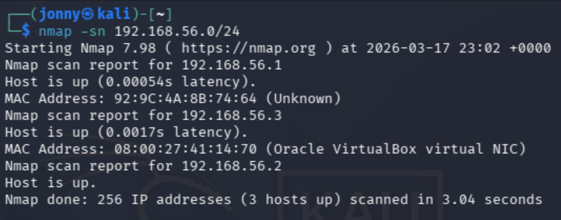
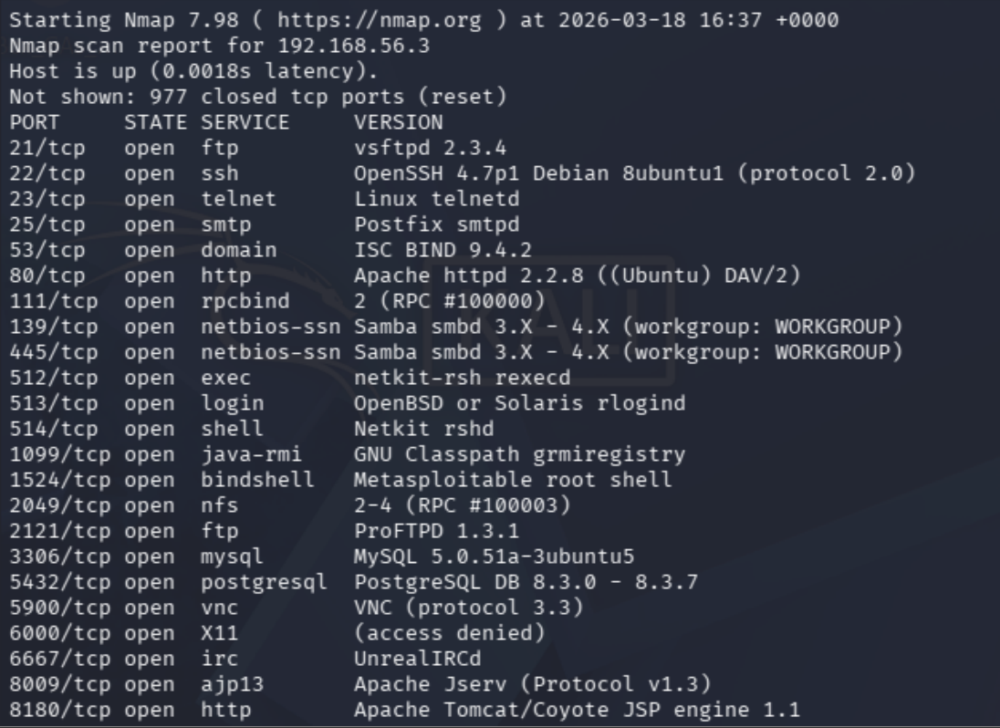

# Metasploitable Lab 1 — Network Reconnaissance

## Objective

The objective of this lab was to discover hosts on the lab network and identify the services running on a vulnerable machine using network scanning techniques.

This is the first stage of most penetration tests and security assessments.

---

## Lab Environment

| Component | Description |
|-----------|-------------|
| Host Machine | MacBook Pro (Intel, 16GB RAM) |
| Virtualization | VirtualBox |
| Attacker Machine | Kali Linux |
| Target Machine | Metasploitable 2 |
| Network | VirtualBox Host-only Network |
| Network Range | 192.168.56.0/24 |

### Lab Network Topology
```
Internet

|

Kali Linux (eth0 - NAT)

|

Kali Linux (eth1 - Host-only)

|


192.168.56.0/24 Lab Network

|

Metasploitable 2
```

## Tools Used

| Tool | Purpose |
|------|--------|
| Nmap | Network discovery and service enumeration |

Nmap (Network Mapper) is a widely used cybersecurity tool that allows security professionals to discover hosts and services on a network.

---

# Step 1 — Host Discovery

Before scanning a target, it is useful to identify which systems are active on the network.

This was performed using the following command:

```bash
nmap -sn 192.168.56.0/24
```



## Command Breakdown

| Option | Meaning |
|------|------|
| `nmap` | Launch the network scanning tool |
| `-sn` | Ping scan (host discovery only) |
| `192.168.56.0/24` | Scan the entire lab subnet |

This command sends ICMP and ARP probes to determine which hosts are alive on the network.

---

## Results

```
Nmap scan report for 192.168.56.1
Host is up

Nmap scan report for 192.168.56.3
Host is up

Nmap scan report for 192.168.56.2
Host is up
```

---

## Identified Hosts

| IP Address | Device |
|-----------|--------|
| `192.168.56.1` | VirtualBox host adapter |
| `192.168.56.2` | Kali Linux |
| `192.168.56.3` | Metasploitable target |

---

## Target Identified

The target machine for further investigation was identified as: `192.168.56.3`

# Step 2 - Service Enumeration

## Objective
After identifying the target host, a port scan was performed to determine which services were running on the system.

---

## Command Used

```bash
nmap -sS -sV -T4 192.168.56.3
```

---

## Command Breakdown

| Option | Meaning |
|--------|--------|
| `-sS` | SYN stealth scan |
| `-sV` | Service version detection |
| `-T4` | Faster scan timing |

---

## Why These Options Are Used

### SYN Scan (`-sS`)
This scan sends a SYN packet to determine if a port is open without completing the TCP handshake.  
It is often called a stealth scan because it is faster and less noisy.

### Service Version Detection (`-sV`)
This option probes open ports to determine what software and version is running.  

Knowing software versions helps identify known vulnerabilities.

### Timing Template (`-T4`)
This increases scan speed while remaining reliable on a local network.

---

## Scan Results

```
PORT     STATE SERVICE     VERSION
21/tcp   open  ftp         vsftpd 2.3.4
22/tcp   open  ssh         OpenSSH 4.7p1 Debian
23/tcp   open  telnet      Linux telnetd
25/tcp   open  smtp        Postfix smtpd
53/tcp   open  domain      ISC BIND 9.4.2
80/tcp   open  http        Apache httpd 2.2.8
111/tcp  open  rpcbind
139/tcp  open  netbios-ssn Samba
445/tcp  open  netbios-ssn Samba
512/tcp  open  exec
513/tcp  open  login
514/tcp  open  shell
1099/tcp open  java-rmi
1524/tcp open  bindshell
2049/tcp open  nfs
2121/tcp open  ftp         ProFTPD
3306/tcp open  mysql
5432/tcp open  postgresql
5900/tcp open  vnc
6000/tcp open  X11
6667/tcp open  irc         UnrealIRCd
8009/tcp open  ajp13
8180/tcp open  http        Apache Tomcat
```


---

## Key Findings

The scan revealed that the Metasploitable machine exposes many services that are either outdated or intentionally vulnerable.

### Notable Services

| Port | Service | Notes |
|------|--------|------|
| `21` | FTP | vsftpd 2.3.4 (known backdoor vulnerability) |
| `23` | Telnet | Insecure remote login |
| `80` | Apache HTTP | Web application attack surface |
| `445` | Samba | File sharing service |
| `1524` | Root bindshell | Direct shell access |
| `3306` | MySQL | Database service |
| `6667` | UnrealIRCd | Known backdoor vulnerability |


---

## Security Concepts Learned

This lab demonstrated several core cybersecurity concepts:

- **Network Discovery** - Identifying active hosts on a network  
- **Port Scanning** - Determining which ports are open on a system  
- **Service Enumeration** - Identifying the software running on open ports  
- **Attack Surface Identification** - Understanding which services may be vulnerable to exploitation  

---

## Lessons Learned

- Reconnaissance is the first step of any penetration test  
- Identifying service versions is critical for finding vulnerabilities  
- Many systems expose multiple network services, increasing attack surface  
- Nmap is one of the most important tools in a security professional’s toolkit  