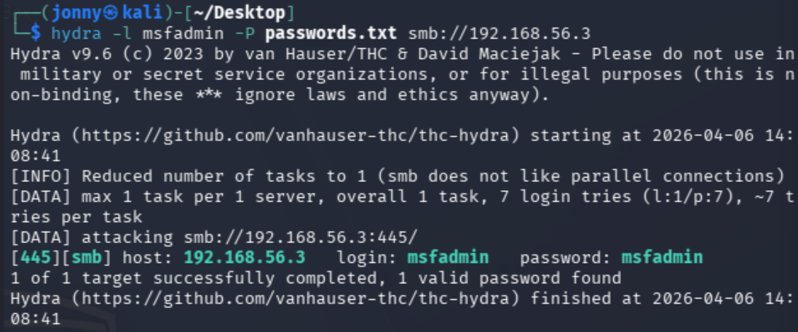
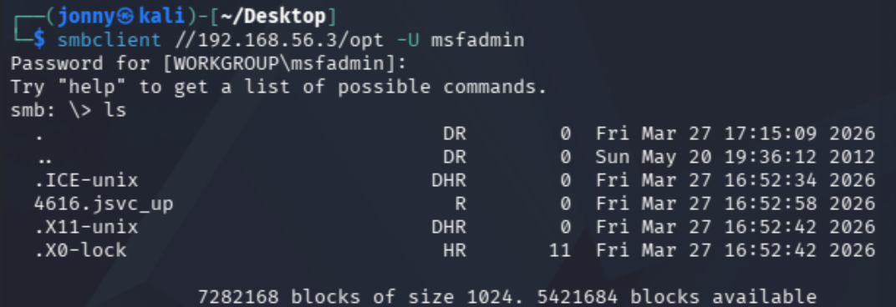
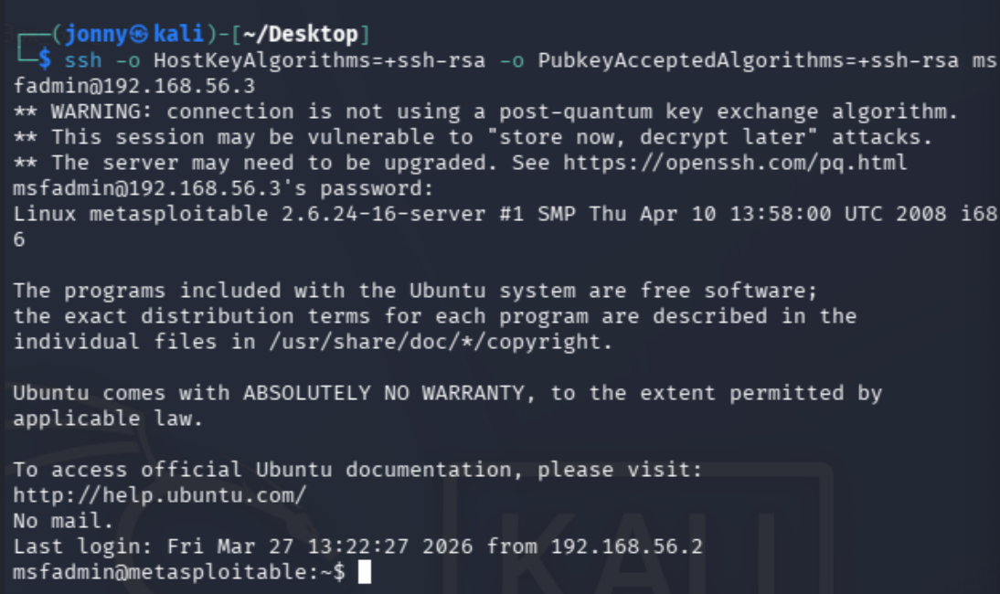
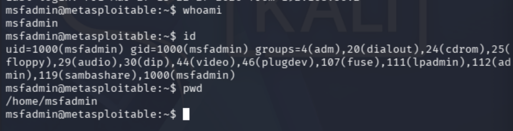
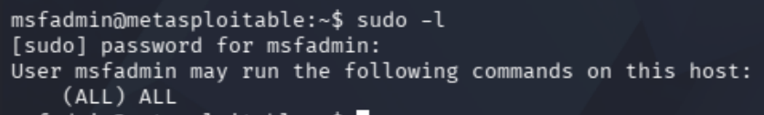
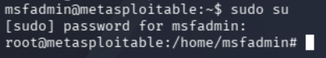
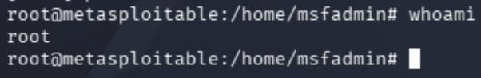

# Metasploitable Lab 6 — Credential Attacks, SSH Access, and Privilege Escalation via Sudo Misconfiguration

## Objective

The objective of this lab was to perform a credential-based attack against the target system using previously enumerated SMB users, gain authenticated access via SSH, and escalate privileges to root through a misconfigured sudo policy.

This lab demonstrates a realistic attack chain using credential compromise rather than direct exploitation.

---

## Lab Environment

| Component | Description |
|-----------|-------------|
| Host Machine | MacBook Pro (Intel, 16GB RAM) |
| Virtualization | VirtualBox |
| Attacker Machine | Kali Linux |
| Target Machine | Metasploitable 2 |
| Network | VirtualBox Host-only Network |
| Network Range | 192.168.56.0/24 |

### Lab Network Topology

Internet

|

Kali Linux (eth0 - NAT)

|

Kali Linux (eth1 - Host-only)

|

192.168.56.0/24 Lab Network

|

Metasploitable 2

---

## Tools Used

| Tool | Purpose |
|------|--------|
| Hydra | Password brute-force / credential attack |
| smbclient | SMB authentication testing |
| SSH | Remote login service |
| Linux commands | Local enumeration and privilege escalation |

---

# Step 1 — Credential Attack Preparation

From previous SMB enumeration, several usernames were identified:

msfadmin  
user  
root  
www-data  

The account msfadmin was prioritised due to its likelihood of using default or weak credentials.

---

# Step 2 — Password Attack with Hydra

## Initial Attempt

hydra -l msfadmin -P /usr/share/wordlists/rockyou.txt smb://192.168.56.3  

---

## Issue Encountered

- rockyou.txt was not extracted
- Large wordlist resulted in extremely slow attack (~100+ hours)

---

## Solution — Targeted Wordlist

A smaller custom password list was created:

msfadmin  
password  
123456  
admin  
root  
toor  
letmein  

---

## Successful Attack

hydra -l msfadmin -P passwords.txt smb://192.168.56.3  

---



## Result

Successful credentials identified:

login: msfadmin  
password: msfadmin  

---

## Analysis

- Default credentials were in use  
- Targeted attacks are significantly more efficient than large brute-force attempts  
- Credential compromise achieved without exploiting vulnerabilities  

---

# Step 3 — SMB Authentication Verification

## Command Used

smbclient //192.168.56.3/tmp -U msfadmin  



---

## Result

- Authentication successful  
- Access to SMB share confirmed  

---

## Analysis

- Valid credentials confirmed  
- However, no additional access beyond anonymous permissions was gained on this share  
- Indicates globally misconfigured share permissions  

---

# Step 4 — SSH Access Attempt

## Initial Issue

ssh msfadmin@192.168.56.3  

Resulted in:

no matching host key type found  

---

## Resolution

ssh -o HostKeyAlgorithms=+ssh-rsa -o PubkeyAcceptedAlgorithms=+ssh-rsa msfadmin@192.168.56.3  



### SSH Compatibility Adjustment

The initial SSH connection failed due to unsupported legacy key algorithms on the target system. Metasploitable uses outdated SSH keys (e.g. `ssh-rsa`) which are disabled by default on modern systems like Kali.

To resolve this, legacy algorithms were enabled:

```bash
ssh -o HostKeyAlgorithms=+ssh-rsa -o PubkeyAcceptedAlgorithms=+ssh-rsa msfadmin@192.168.56.3
```

This allowed the connection to succeed and highlights how attackers may need to adapt to older, less secure systems.

---

## Authentication

Password used:

msfadmin  

---

## Result

Login successful:

msfadmin@metasploitable:~$  

---

## Analysis

- SSH access successfully obtained using cracked credentials  
- Required enabling legacy cryptographic algorithms due to outdated server  
- Demonstrates real-world compatibility issues with legacy systems  

---

# Step 5 — Local Enumeration

## Commands Used

whoami  
id  
pwd  



---

## Output

whoami → msfadmin  
id → uid=1000(msfadmin) gid=1000(msfadmin)  
pwd → /home/msfadmin  

---

## Analysis

- Standard user access confirmed  
- No elevated privileges initially available  

---

# Step 6 — Sudo Privilege Check

## Command Used

sudo -l  



---

## Result

User msfadmin may run the following commands on this host:  
(ALL) ALL  

---

## Analysis

- User allowed to execute any command as root  
- Indicates critical misconfiguration  
- Provides direct privilege escalation path  

---

# Step 7 — Privilege Escalation

## Command Used

sudo su  



---

## Authentication

Password:

msfadmin  

---

## Verification

whoami  



---

## Output

root  

---

## Analysis

- Privilege escalation successful  
- Full system compromise achieved  
- No exploitation required, only misconfiguration abuse  

---

# Security Concepts Learned

This lab demonstrated several critical concepts:

- **Credential Attacks** — Exploiting weak or default passwords  
- **Wordlist Strategy** — Importance of targeted password lists  
- **Authentication vs Exploitation** — Gaining access without vulnerabilities  
- **Credential Reuse** — Using credentials across multiple services  
- **SSH Access** — Gaining interactive system control  
- **Legacy System Issues** — Weak cryptographic configurations  
- **Local Enumeration** — Identifying privilege escalation paths  
- **Sudo Misconfiguration** — Critical access control failure  
- **Privilege Escalation** — Transition from user to root access  

---

# Lessons Learned

- Credential attacks are often more effective than exploits  
- Default credentials remain a major security risk  
- Smaller, targeted wordlists are more efficient than large brute-force lists  
- Authentication access can be more powerful than exploitation  
- Misconfigured sudo permissions can lead to immediate full compromise  
- Legacy systems introduce additional security weaknesses  
- Enumeration is critical after gaining initial access  
- Real-world attacks often rely on chaining simple weaknesses  

---

# Final Outcome

- Valid credentials obtained through password attack  
- SMB authentication confirmed  
- SSH access established  
- Local system enumeration performed  
- Sudo misconfiguration identified  
- Privilege escalation achieved  
- Root access obtained  